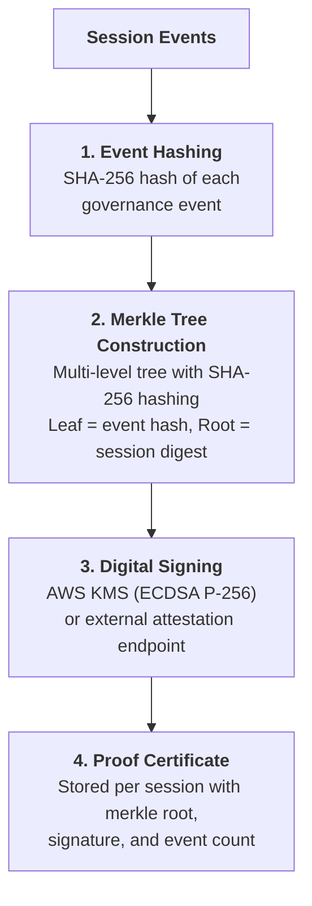

# Attestation & Cryptographic Proof

## Overview

OpenBox produces cryptographic, tamper-proof evidence for every governance session. Each session's events are hashed into a Merkle tree and digitally signed, creating a verifiable proof certificate that confirms no governance data was altered after the fact.

OpenBox supports two signing providers:

- **AWS KMS** — Signs with ECDSA NIST P-256 via AWS Key Management Service (default)
- **External Attestation** — Signs via your own attestation service endpoint, enabling integration with Trusted Execution Environments (TEEs) or custom signing infrastructure

### Use Cases

| Scenario | How Attestation Helps |
|----------|----------------------|
| **Audit evidence** | Provide auditors with signed proof that governance decisions were recorded accurately |
| **Legal disputes** | Demonstrate with cryptographic certainty that an agent's actions were governed at a specific time |
| **Incident investigation** | Verify that the event timeline for a security incident has not been tampered with |
| **Hardware-backed trust** | Use external attestation with a TEE to provide hardware-level signing guarantees |

---

## How It Works

When an agent session completes, OpenBox constructs a cryptographic proof through the following pipeline:

### Components

| Component | Description |
|-----------|-------------|
| **Event Hashing** | Each governance event is hashed using SHA-256 to produce a unique fingerprint |
| **Merkle Tree** | A multi-level hash tree that combines individual event hashes into a single session root. Uses sorted-pair hashing to ensure consistent tree construction regardless of processing order |
| **Digital Signature** | The session root is signed using either AWS KMS or an external attestation provider, depending on agent configuration |
| **Proof Certificate** | The signed attestation record containing the Merkle root, signature, and event count — one per session |

---

## Signing Providers

Each agent can be configured with its own signing provider. If no external attestation is configured, AWS KMS is used by default.

### AWS KMS (Default)

OpenBox creates a dedicated signing key per agent in AWS Key Management Service using ECDSA NIST P-256. When a session completes, the session's Merkle root is sent to AWS KMS for signing.

- **Algorithm:** ECDSA NIST P-256 (ECDSA_SHA_256)
- **Key management:** One key per agent, managed by AWS KMS
- **Authentication:** IAM credentials or Web Identity (OIDC)

### External Attestation

For organizations that require signing within their own infrastructure — such as inside a Trusted Execution Environment (TEE) — OpenBox supports external attestation endpoints. OpenBox sends the session data to your signing service and receives the signed attestation in return.

- **Protocol:** HTTPS
- **Authentication:** Optional bearer token
- **Use cases:** TEE-based signing (e.g., AWS Nitro Enclaves, Intel SGX), HSM-backed signing, custom PKI infrastructure

### Configuring External Attestation

During agent creation:

1. Select **External Attestation** as the attestation mode
2. Enter the **domain** of your attestation service
3. Optionally provide a **bearer token** for authentication
4. Use **Test Connection** to verify your service is reachable

Once configured, all sessions for that agent will be signed by your external attestation service instead of AWS KMS.

---

## Proof Certificate

Each session produces one proof certificate containing:

| Field | Description |
|-------|-------------|
| **Merkle Root** | The SHA-256 root hash of the session's event Merkle tree |
| **Signature** | Digital signature of the Merkle root (from AWS KMS or external provider) |
| **Event Count** | Number of governance events included in this session's attestation |

---

## Viewing Attestations

### From Agent Detail

1. Navigate to the **Agent Detail** page
2. Click the **Verify** tab
3. The **Session Integrity** section shows the Merkle root, hash chain count, and signature status
4. Click on any event to open the detail modal
5. Select the **Cryptographic Proof** tab in the modal

### What You See

- **Merkle tree visualization** — interactive tree showing event hashes and the verification path
- **Digital signature section** — signing algorithm, signature value, and signing timestamp
- **Hash chain section** — individual event hashes with their Merkle proofs

## Related

- **[Audit Log](/docs/administration/organization-audit-log)** - View and export the organization-wide audit log
- **[Compliance & Audit](/docs/administration/compliance-and-audit)** - Overview of audit trail and evidence collection

