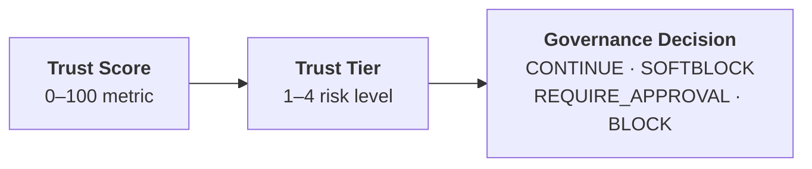

# Core Concepts

OpenBox governs AI agents through three foundational concepts: Trust Scores quantify trustworthiness, Trust Tiers translate scores into control levels, and Governance Decisions determine what happens at runtime.

| Concept | Description |
|---------|-------------|
| **[Trust Scores](/docs/core-concepts/trust-scores)** | A 0–100 metric based on risk profile, behavioral compliance, and goal alignment |
| **[Trust Tiers](/docs/core-concepts/trust-tiers)** | Four risk levels that determine how strictly an agent is governed |
| **[Governance Decisions](/docs/core-concepts/governance-decisions)** | The four possible outcomes when an agent operation is evaluated |

## How They Connect

An agent's **Trust Score** determines its **Trust Tier**, which influences the policies and guardrails that produce **Governance Decisions** at runtime.
