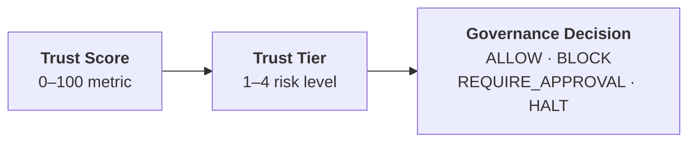

# Core Concepts

OpenBox governs AI agents through three foundational concepts: Trust Scores quantify trustworthiness, Trust Tiers translate scores into control levels, and Governance Decisions determine what happens at runtime.

| Term | Description |
|------|-------------|
| **Risk Profile Score** | Initial assessment score (0–100) based on your agent's risk questionnaire. Set during the [Assess phase](/trust-lifecycle/assess) |
| **[Trust Score](/core-concepts/trust-scores)** | Ongoing score (0–100) combining Risk Profile (40%) + Behavioral (35%) + Alignment (25%) |
| **[Trust Tier](/core-concepts/trust-tiers)** | Tier label (1–4) derived from Risk Profile Score ranges that determines how strictly an agent is governed |
| **[Governance Decision](/core-concepts/governance-decisions)** | Runtime verdict (one of four) that determines whether an agent operation is allowed, blocked, or requires approval |

## How They Connect

An agent's **Trust Score** determines its **Trust Tier**, which influences the policies and guardrails that produce **Governance Decisions** at runtime.
