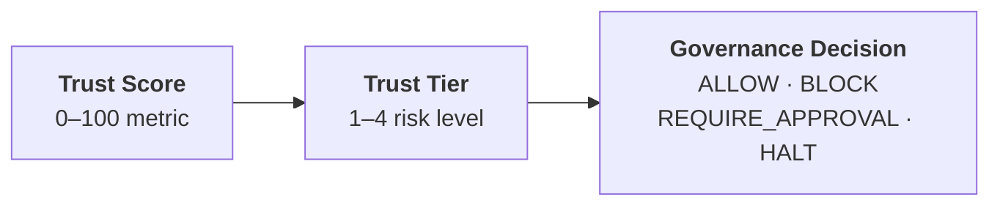

# Core Concepts

OpenBox governs AI agents through a set of connected concepts. Trust Scores quantify trustworthiness, Trust Tiers translate scores into control levels, Governance Decisions determine what happens at runtime, and Agent Lineage connects governed runtimes back to repository and configuration history.

| Term | Description |
|------|-------------|
| **Risk Profile Score** | Initial assessment score (0–100) based on your agent's risk questionnaire. Set during the [Assess phase](/trust-lifecycle/assess) |
| **[Trust Score](/core-concepts/trust-scores)** | Ongoing score (0–100) combining Risk Profile (40%) + Behavioral (35%) + Alignment (25%) |
| **[Trust Tier](/core-concepts/trust-tiers)** | Tier label (Untrusted or 1–4) derived from Trust Score ranges that determines how strictly an agent is governed |
| **[Governance Decision](/core-concepts/governance-decisions)** | Runtime verdict (one of four) that determines whether an agent operation is allowed, blocked, or requires approval |
| **[Agent Lineage](/core-concepts/agent-lineage)** | Repository-to-runtime provenance showing which code, runtime DID, governance versions, and sessions belong together |
| **[Proof of Routing](/core-concepts/proof-of-routing)** | Attested record of which upstream provider served each prompt, in which region, and whether that matched what was requested |

## How They Connect

```mermaid
flowchart LR
    scores["<b>Trust Score</b><br/>0–100 metric"] --> tiers["<b>Trust Tier</b><br/>1–4 risk level"]
    tiers --> decisions["<b>Governance Decision</b><br/>ALLOW · BLOCK<br/>REQUIRE_APPROVAL · HALT"]
```

An agent's **Trust Score** determines its **Trust Tier**, which influences the policies and guardrails that produce **Governance Decisions** at runtime. **Agent Lineage** adds provenance around those governed runs by connecting repository changes, runtime identity, sessions, and governance configuration snapshots. **Proof of Routing** adds provenance in the other direction, for agents on a gateway: which provider and region actually served each prompt after the request left the process.
