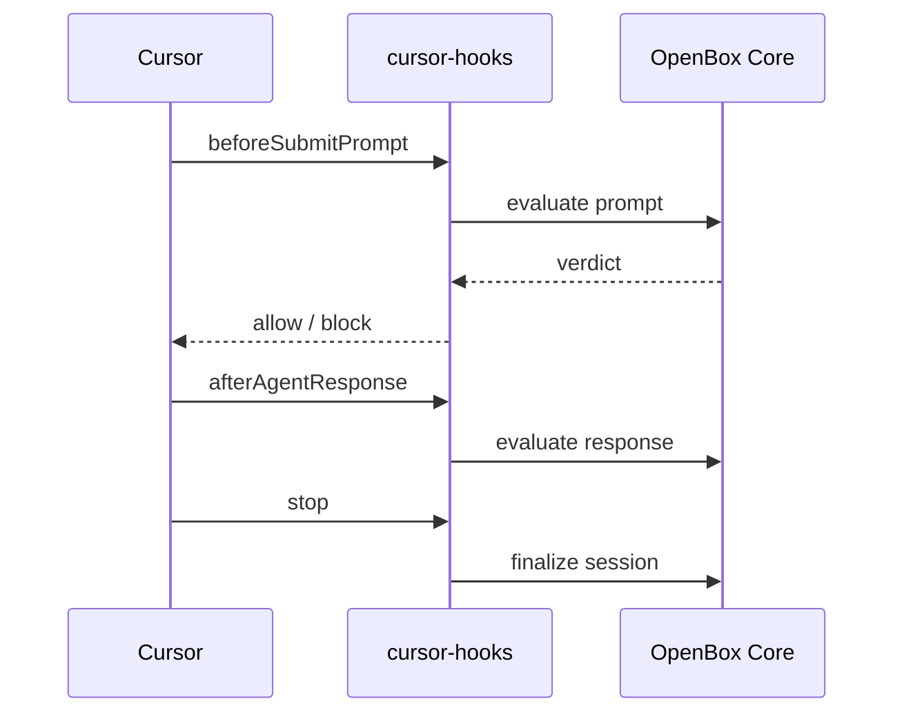

# Cursor

The `cursor-hooks` package connects [Cursor IDE](https://cursor.com) to [OpenBox](https://openbox.ai) via Cursor's official hooks system — giving you governance policies, guardrails, and human oversight over every agent action.

**[OpenBox-AI/cursor-hooks](https://github.com/OpenBox-AI/cursor-hooks)**

## Architecture

Cursor fires hook scripts at each point in the agent loop. `cursor-hooks` intercepts these, sends each action to OpenBox for evaluation, and returns the verdict back to Cursor.

Before-hooks (`beforeSubmitPrompt`, `beforeReadFile`, `beforeShellExecution`, `beforeMCPExecution`) can block or constrain the action. After-hooks observe the result for trust scoring and drift detection.

## Event lifecycle

All hooks within a Cursor conversation share one OpenBox session.

| Cursor hook | What happens |
|-------------|-------------|
| `sessionStart` | Creates the OpenBox session |
| `beforeSubmitPrompt` | Captures user goal, evaluates prompt against guardrails |
| `beforeReadFile` | Evaluates file content, can redact secrets/PII |
| `beforeShellExecution` | Evaluates command against policies |
| `beforeMCPExecution` | Evaluates MCP tool call against policies |
| `afterMCPExecution` | Can redact PII from tool response |
| `afterAgentResponse` | Scores goal alignment between prompt and response |
| `afterAgentThought` | Observes agent reasoning |
| `afterShellExecution` | Records command output |
| `afterFileEdit` | Records file changes |
| `stop` | Finalizes session, generates attestation |

## Verdicts

When OpenBox evaluates an action, it returns a verdict that cursor-hooks enforces in Cursor:

| Verdict | Cursor behavior |
|---------|----------------|
| **Allow** | Action proceeds normally |
| **Constrain** | Sensitive content is redacted from file reads or MCP responses, action proceeds |
| **Require approval** | Action is paused. Approve on the OpenBox dashboard, then retry in Cursor. |
| **Block** | Action is blocked. Cursor shows the policy or guardrail message. |
| **Halt** | Action is blocked and the session is terminated. |

## Guardrails

Guardrails run automatically on before-hooks. Configure them per activity type on the OpenBox dashboard under **Agent → Authorize**:

| Activity type | Available guardrails |
|--------------|---------------------|
| `PromptSubmission` | PII detection, toxicity, content filter, ban words |
| `FileRead` | PII detection, secret redaction |
| `ShellExecution` | Rego policies |
| `MCPToolCall` | Rego policies |
| `MCPToolResponse` | PII detection |

When a guardrail triggers, the verdict determines the behavior — block the action, redact the content, or require approval.

## Redaction

For `FileRead` and `MCPToolResponse`, a **constrain** verdict redacts sensitive content before the agent sees it. The original content is never exposed — Cursor receives the redacted version.

This applies to:
- API keys and tokens in file content
- PII (emails, phone numbers, addresses) in file content or MCP responses
- Any content matched by your guardrail rules

## Human-in-the-loop approvals

When an action receives a **require_approval** verdict, cursor-hooks pauses the action and polls the OpenBox dashboard for a decision. The user approves or rejects on the dashboard, and cursor-hooks enforces the result.

Configure polling behavior in `~/.cursor-hooks/config.json`:
- `HITL_POLL_INTERVAL` — how often to check (default 5 seconds)
- `HITL_MAX_WAIT` — maximum wait before timing out (default 300 seconds)

## Goal alignment

OpenBox automatically compares the user's original prompt against the agent's response to detect drift:

1. When the user submits a prompt, the goal is captured
2. When the agent responds, the response is compared against the goal
3. OpenBox scores alignment from 0-100%

Results are visible in the OpenBox dashboard under **Agent → Verify → Goal Alignment**.

## Configuration

Config file: `~/.cursor-hooks/config.json`

| Setting | Type | Default | Description |
|---------|------|---------|-------------|
| `OPENBOX_API_KEY` | string | — | API key (required) |
| `OPENBOX_ENDPOINT` | string | `https://core.openbox.ai` | Core API URL |
| `GOVERNANCE_POLICY` | string | `fail_open` | `fail_open` allows actions when OpenBox is unreachable. `fail_closed` blocks them. |
| `GOVERNANCE_TIMEOUT` | number | `15` | API timeout in seconds |
| `VERBOSE` | boolean | `false` | Enable detailed logging |
| `DRY_RUN` | boolean | `false` | Allow all actions without calling OpenBox |
| `HITL_ENABLED` | boolean | `true` | Enable human-in-the-loop approval polling |
| `HITL_POLL_INTERVAL` | number | `5` | Seconds between approval status checks |
| `HITL_MAX_WAIT` | number | `300` | Maximum seconds to wait for approval |

## Troubleshooting

### Hooks not firing

Re-run `npm run install-hooks` and restart Cursor.

### File reads getting blocked

Check guardrail configuration for `FileRead` on the OpenBox dashboard. PII detection may flag API keys in file content.
