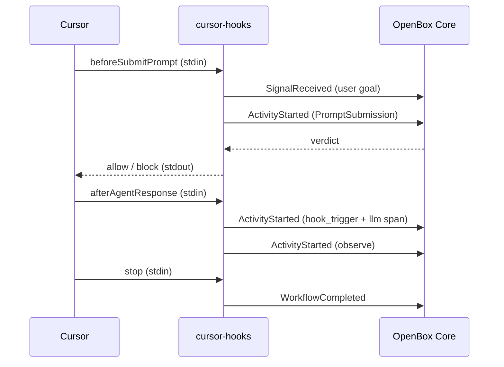

# Cursor

The `cursor-hooks` package connects [Cursor IDE](https://cursor.com) to [OpenBox](https://openbox.ai) via Cursor's official hooks system — giving you governance policies, guardrails, and human oversight over every agent action.

**[OpenBox-AI/cursor-hooks](https://github.com/OpenBox-AI/cursor-hooks)**

## Architecture

`cursor-hooks` operates as a set of external hook scripts invoked by Cursor at each point in the agent loop. Each hook invocation is a separate Node.js process that reads JSON from stdin, calls the OpenBox governance API, and writes JSON to stdout.



## Event lifecycle

All hooks within a Cursor conversation share one `workflow_id`, mapping to a single OpenBox session.

| Cursor hook | OpenBox event | Purpose |
|-------------|--------------|---------|
| `sessionStart` | WorkflowStarted | Creates the session |
| `beforeSubmitPrompt` | SignalReceived + ActivityStarted | Captures user goal, governs prompt |
| `afterAgentResponse` | ActivityStarted (hook trigger) | Sends `llm_completion` span for alignment |
| `beforeShellExecution` | ActivityStarted | Governs shell command |
| `afterShellExecution` | ActivityCompleted | Closes shell activity with output |
| `stop` | WorkflowCompleted | Finalizes session and attestation |

### Session persistence

Each hook runs as a separate process. Sessions are persisted to `~/.cursor-hooks/sessions/` as JSON files, keyed by `{conversation_id}:{activity_type}`.

## Hook handlers

### Before-hooks (can block)

| Hook | Handler | What it does |
|------|---------|-------------|
| `beforeSubmitPrompt` | `mappers/prompt.ts` | Sends user goal via `SignalReceived`. Governs prompt input. |
| `beforeReadFile` | `mappers/file-read.ts` | Governs file content. Can block, allow, or redact. |
| `beforeShellExecution` | `mappers/shell.ts` | Governs shell commands via Rego policies. |
| `beforeMCPExecution` | `mappers/mcp.ts` | Governs MCP tool calls. |

### After-hooks (observe only)

| Hook | Handler | What it does |
|------|---------|-------------|
| `afterAgentResponse` | `mappers/observe.ts` | Sends `llm_completion` span for goal alignment. |
| `afterAgentThought` | `mappers/observe.ts` | Observes agent reasoning. |
| `afterShellExecution` | `mappers/observe.ts` | Completes shell lifecycle. |
| `afterMCPExecution` | `mappers/mcp-response.ts` | Can redact PII from tool output. |
| `afterFileEdit` | `mappers/observe.ts` | Observes file changes. |

## Span instrumentation

### LLM completion span

The `afterAgentResponse` handler sends an `llm_completion` span as a hook trigger for goal alignment:

```json
{
  "event_type": "ActivityStarted",
  "hook_trigger": true,
  "span_count": 1,
  "spans": [{
    "name": "POST https://api.openai.com/v1/chat/completions",
    "kind": "CLIENT",
    "stage": "completed",
    "start_time": 1711526130000000000,
    "end_time": 1711526133000000000,
    "attributes": {
      "http.method": "POST",
      "http.url": "https://api.openai.com/v1/chat/completions",
      "http.status_code": 200
    },
    "request_body": "{\"messages\":[{\"role\":\"user\",\"content\":\"fix the bug\"}]}",
    "response_body": "{\"choices\":[{\"message\":{\"content\":\"I fixed the bug by...\"}}]}"
  }]
}
```

`request_body` contains the original user prompt (stored during `beforeSubmitPrompt`). `response_body` contains the agent's response. OpenBox compares these for goal alignment scoring.

### Semantic type mapping

| Activity type | Span attributes | Server classification |
|--------------|----------------|----------------------|
| `PromptSubmission` | `http.url` = LLM domain | `llm_completion` |
| `FileRead` | `file.path` set | `file_read` |
| `ShellExecution` | No HTTP/file/DB attrs | `internal` |
| `MCPToolCall` | `http.method` + `http.url` set | `http_post` |

## Goal alignment (drift detection)

1. `beforeSubmitPrompt` sends a `SignalReceived` event with the user's prompt as the goal
2. `afterAgentResponse` sends an `llm_completion` span (via hook trigger) with `request_body` = user prompt, `response_body` = agent response
3. OpenBox scores alignment 0-100%. Below 50% = drift detected.

The score is returned in `age_result.span_results[].alignment_result`.

## Configuration

Config file: `~/.cursor-hooks/config.json`

| Setting | Type | Default | Description |
|---------|------|---------|-------------|
| `OPENBOX_API_KEY` | string | — | API key (required) |
| `OPENBOX_ENDPOINT` | string | `https://core.openbox.ai` | Core API URL |
| `GOVERNANCE_POLICY` | string | `fail_open` | `fail_open` or `fail_closed` |
| `GOVERNANCE_TIMEOUT` | number | `15` | API timeout in seconds |
| `VERBOSE` | boolean | `false` | Debug logging to stderr and log file |
| `DRY_RUN` | boolean | `false` | Allow all actions, skip API calls |
| `HITL_ENABLED` | boolean | `true` | Enable HITL approval polling |
| `HITL_POLL_INTERVAL` | number | `5` | Approval poll interval (seconds) |
| `HITL_MAX_WAIT` | number | `300` | Approval timeout (seconds) |
| `TASK_QUEUE` | string | `cursor-hooks` | Task queue name |
| `SEND_START_EVENT` | boolean | `true` | Send WorkflowStarted events |
| `SEND_ACTIVITY_START_EVENT` | boolean | `true` | Send ActivityStarted events |
| `MAX_BODY_SIZE` | number | unlimited | Max bytes for input/output body |
| `SKIP_ACTIVITY_TYPES` | string | — | Comma-separated activity types to skip |

## Project structure

```text
src/
  hook-handler.ts      Entry point — reads stdin, routes, writes stdout
  config.ts            Config from env vars / config.json / .env
  governance.ts        OpenBox bridge — lifecycle, API calls, metadata
  session-store.ts     Disk-based session persistence across hook invocations
  verdict-mapper.ts    Verdict → Cursor hook JSON response
  types.ts             Type definitions
  logger.ts            Structured logging (file + stderr)
  mappers/
    prompt.ts          beforeSubmitPrompt
    file-read.ts       beforeReadFile
    shell.ts           beforeShellExecution
    mcp.ts             beforeMCPExecution
    mcp-response.ts    afterMCPExecution
    observe.ts         After-hooks + sessionStart + stop
```

## Troubleshooting

### Hooks not firing

Check that `~/.cursor/hooks.json` exists and points to `~/.cursor-hooks/hook-handler.js`. Re-run `npm run install-hooks` and restart Cursor.

### File reads getting blocked

Check guardrail configuration for `FileRead` on the OpenBox dashboard. PII detection may flag API keys in file content.

### Alignment score is null

1. Confirm `beforeSubmitPrompt` fires before `afterAgentResponse` (check `~/.cursor-hooks/hook.log`)
2. The `llm_completion` span must have `stage: "completed"`
3. Goal alignment must be enabled on the dashboard
