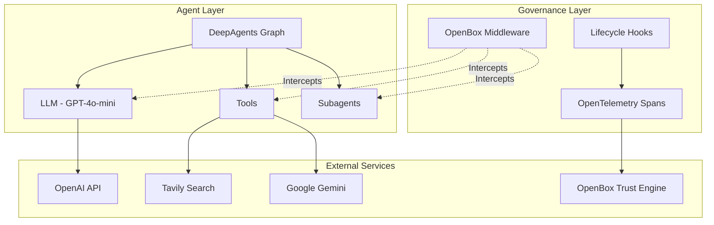
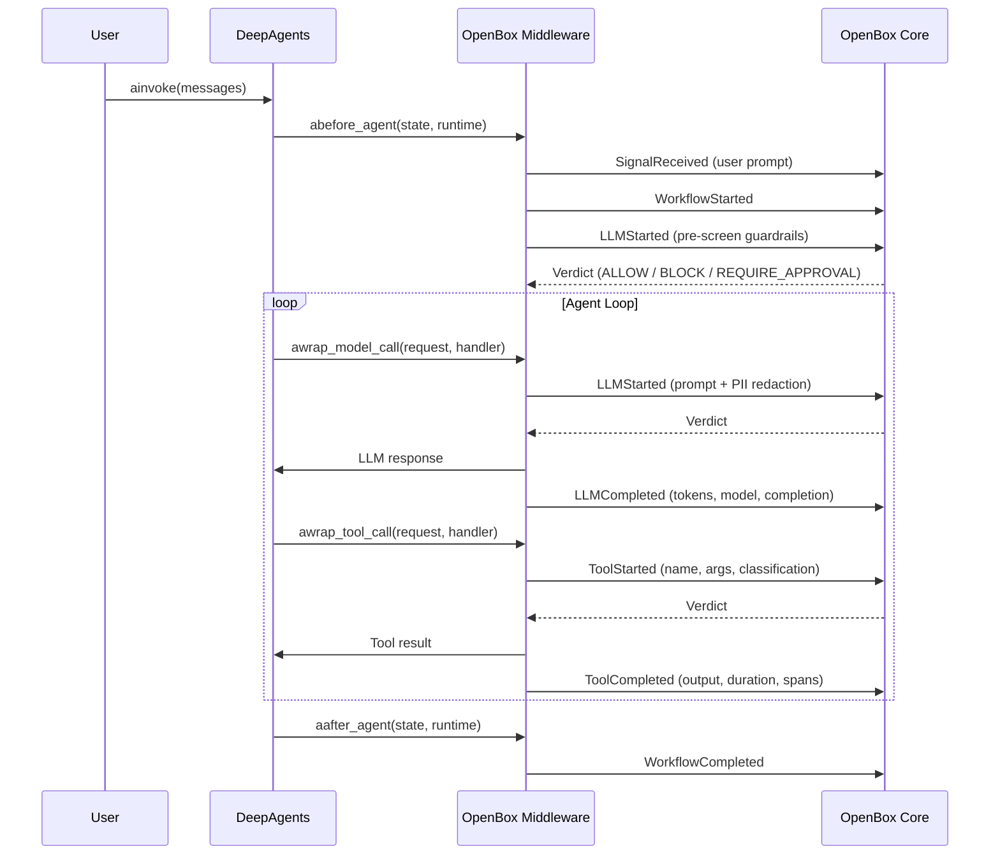

# Demo Architecture Reference

Quick reference for the [content builder agent](https://github.com/OpenBox-AI/openbox-deepagent-sdk-python/tree/main/examples/content-builder-agent) architecture. For setup, see the [Integration Guide](/developer-guide/deep-agents/integration-walkthrough). For customization, see [Extending the Demo Agent](/developer-guide/deep-agents/customizing-the-demo).

## System Layers



| Layer | Technology | Role |
|-------|-----------|------|
| **Agent** | DeepAgents, LangChain | Runs the agent loop, dispatches tools and subagents |
| **Governance** | OpenBox Middleware | Intercepts model and tool calls for policy evaluation |
| **External** | OpenAI, Tavily, Gemini, OpenBox | LLM providers, search, image generation, trust engine |

## Middleware Hooks Lifecycle

The `OpenBoxMiddleware` implements 4 async hooks (plus 4 sync variants) that DeepAgents calls at runtime:



### Hook Details

| Hook | When | What OpenBox Does |
|------|------|-------------------|
| `abefore_agent` | Before agent graph runs | Sends `SignalReceived`, `WorkflowStarted`, pre-screen `LLMStarted`; caches guardrails response |
| `awrap_model_call` | Before every LLM call | Runs PII redaction on prompt; sends `LLMStarted`/`LLMCompleted` with token counts |
| `awrap_tool_call` | Before every tool execution | Classifies tool type; enriches with `__openbox` metadata; sends `ToolStarted`/`ToolCompleted` |
| `aafter_agent` | After agent graph completes | Sends `WorkflowCompleted`; cleans up span processor state |

## Governance Event Flow

Every agent invocation produces this sequence of events sent to OpenBox Core:

| # | Event | Trigger | Key Data |
|---|-------|---------|----------|
| 1 | `SignalReceived` | User prompt arrives | `signal_name: "user_prompt"`, prompt text |
| 2 | `WorkflowStarted` | Agent begins | Agent state, workflow ID, thread ID |
| 3 | `LLMStarted` | Pre-screen | User prompt for guardrails check |
| 4 | `LLMStarted` | Each model call | Prompt messages (after PII redaction) |
| 5 | `LLMCompleted` | Model responds | Token counts, model name, completion text |
| 6 | `ToolStarted` | Each tool call | Tool name, args, `__openbox` metadata |
| 7 | `ToolCompleted` | Tool returns | Output, duration, OTel spans |
| 8 | `WorkflowCompleted` | Agent finishes | Final output, status |

### Verdict Enforcement

| Verdict | Behavior |
|---------|----------|
| `ALLOW` | Tool/LLM executes normally |
| `BLOCK` | `GovernanceBlockedError` raised — single tool blocked, agent may continue |
| `HALT` | `GovernanceHaltError` raised — entire session terminated |
| `REQUIRE_APPROVAL` | Middleware polls for human decision; proceeds or halts based on response |

## Subagent Dispatch

When the agent calls the `task` tool to dispatch a subagent, the middleware:

1. **Detects the subagent** — extracts `subagent_type` from tool args via `resolve_subagent_from_tool_call()`
2. **Classifies as `a2a`** — if the subagent name is in `known_subagents`
3. **Enriches activity input** — appends `__openbox` sentinel for Rego targeting:

```json
{
  "description": "Research AI agents and save to research/ai-agents.md",
  "subagent_type": "researcher",
  "__openbox": {
    "tool_type": "a2a",
    "subagent_name": "researcher"
  }
}
```

### Built-in Tool Detection

The SDK recognizes DeepAgents built-in tools and treats them differently:

```python
DEEPAGENT_BUILTIN_TOOLS = frozenset({
    "write_todos", "ls", "read_file", "write_file", "edit_file",
    "glob", "grep", "execute", "task"
})
```

Only the `task` tool triggers subagent detection. Other built-in tools are governed as regular tool calls.

## Tool Classification

Tool types are resolved in priority order:

| Priority | Source | Example |
|----------|--------|---------|
| 1 | `tool_type_map` (explicit) | `"web_search"` → `"http"` |
| 2 | Subagent detection (automatic) | `"task"` + researcher → `"a2a"` |
| 3 | None (default) | `"generate_cover"` → governed by default policies |

Classified tools get `__openbox` metadata appended to their activity input, enabling category-level Rego policies.

## OpenTelemetry Instrumentation

The middleware uses a `WorkflowSpanProcessor` to capture HTTP calls, database queries, and file I/O during tool execution:

1. Before a tool runs, the middleware registers a trace context with the span processor
2. During tool execution, OTel auto-instrumentation captures outbound HTTP requests
3. After the tool completes, captured spans are attached to the `ToolCompleted` event
4. The span processor cleans up on `WorkflowCompleted`

This gives OpenBox visibility into what external calls each tool makes — not just the tool's input/output, but the actual HTTP requests to OpenAI, Tavily, etc.

## Pre-Screen Optimization

The first LLM call in each invocation reuses the pre-screen guardrails response from `abefore_agent`. This avoids a duplicate governance call:

1. `abefore_agent` sends `LLMStarted` with the user prompt → gets verdict + PII redaction
2. `awrap_model_call` detects `_first_llm_call=True` → reuses cached `_pre_screen_response`
3. Subsequent LLM calls go through the full governance path

## Key Files

| Path | Purpose |
|------|---------|
| `content_writer.py` | Agent factory — `create_content_writer()` integration point |
| `AGENTS.md` | Brand voice and writing standards (loaded as memory) |
| `subagents.yaml` | Subagent definitions — name, description, tools |
| `skills/blog-post/SKILL.md` | Blog post workflow with research, structure, image generation |
| `skills/social-media/SKILL.md` | Social media workflow for LinkedIn and Twitter/X |
| `.env` | API keys and OpenBox configuration |

### SDK Source Files

| Path | Purpose |
|------|---------|
| `openbox_deepagent/__init__.py` | Public API — re-exports errors, types, middleware |
| `openbox_deepagent/middleware_factory.py` | `create_openbox_middleware()` factory function |
| `openbox_deepagent/middleware.py` | `OpenBoxMiddleware` class — hooks and state management |
| `openbox_deepagent/middleware_hooks.py` | Stateless hook implementations — event construction and governance calls |
| `openbox_deepagent/subagent_resolver.py` | Subagent detection, built-in tool constants, HITL conflict detection |
