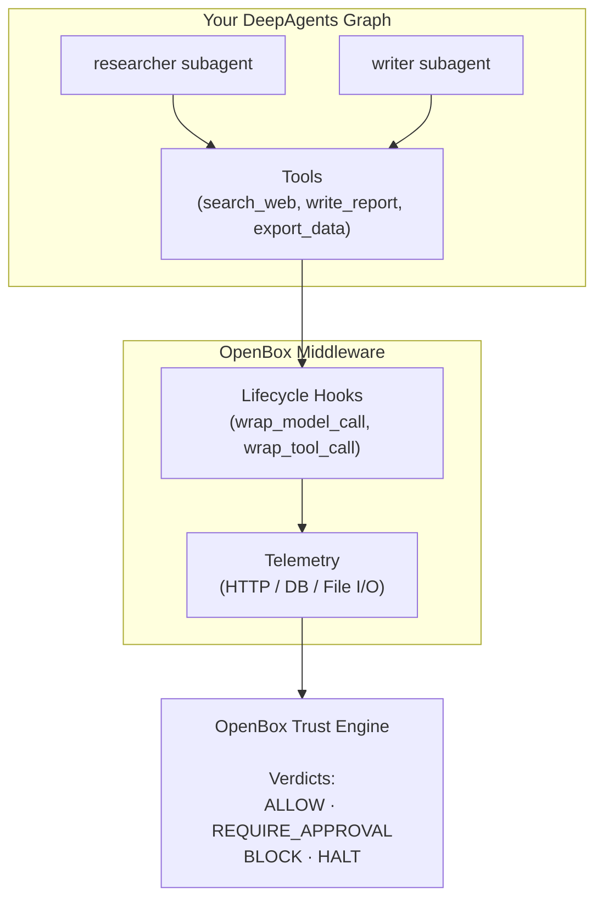

# Deep Agents SDK (Python)

The `openbox-deepagent-sdk-python` package provides real-time governance and observability for [DeepAgents](https://github.com/langchain-ai/deepagents). It extends [`openbox-langgraph-sdk`](/developer-guide/langgraph) with features specific to the DeepAgents multi-agent framework.

| Guide | Description |
|-------|-------------|
| **[Configuration](/developer-guide/deep-agents/configuration)** | Environment variables and all middleware parameters |
| **[Error Handling](/developer-guide/deep-agents/error-handling)** | Handle governance decisions and failures in your code |

:::info What the SDK Does
The SDK's primary job is to **connect your DeepAgents graph to OpenBox** and evaluate governance on every model call, tool call, and subagent dispatch. All trust logic, policy evaluation, and UI management happens on the OpenBox platform — not in the SDK.
:::

## Philosophy

The SDK is intentionally minimal:

- **One middleware object** wraps your `create_deep_agent()` graph (`create_openbox_middleware`)
- **Zero graph changes** — your subagents, tools, and graph structure stay exactly as they are
- **Per-subagent governance** — policies can target specific subagents by name
- **Automatic telemetry** — captures HTTP, database, and file I/O operations via OpenTelemetry

## Installation

```bash
pip install openbox-deepagent-sdk-python

# Or with uv
uv add openbox-deepagent-sdk-python
```

**Requires Python 3.11+.**

## Factory Function

```python
from openbox_deepagent import create_openbox_middleware

def create_openbox_middleware(
    *,
    api_url: str,
    api_key: str,
    agent_name: str | None = None,
    known_subagents: list[str] | None = None,
    # + governance, instrumentation options
) -> OpenBoxMiddleware
```

Returns an `OpenBoxMiddleware` instance that implements the DeepAgents `AgentMiddleware` interface. Pass it to `create_deep_agent(middleware=[middleware])`.

See **[Configuration](/developer-guide/deep-agents/configuration)** for the full parameter list.

## Middleware Hooks

`OpenBoxMiddleware` implements 8 lifecycle hooks that DeepAgents calls at runtime. You do not call these directly — they fire automatically.

| Hook | When it fires | What OpenBox does |
|------|--------------|-------------------|
| `before_agent` | Before the agent graph runs | Records session start, registers subagent context |
| `after_agent` | After the agent graph completes | Records session completion, finalizes telemetry |
| `wrap_model_call` | Before every LLM call | Runs PII redaction; sends `LLMStarted` event |
| `wrap_tool_call` | Before every tool execution | Evaluates governance policy; sends `ActivityStarted` event |
| `abefore_agent` | Async variant of `before_agent` | Same as above, async-safe |
| `aafter_agent` | Async variant of `after_agent` | Same as above, async-safe |
| `awrap_model_call` | Async variant of `wrap_model_call` | Same as above, async-safe |
| `awrap_tool_call` | Async variant of `wrap_tool_call` | Same as above, async-safe |

Governance decisions (`ALLOW`, `BLOCK`, `HALT`, `REQUIRE_APPROVAL`) are evaluated inside `wrap_tool_call`. A `BLOCK` decision raises `GovernanceBlockedError` before the tool runs.

## What the SDK Captures

| Category | Details |
|----------|---------|
| **Model calls** | Prompts, completions, model name, token counts, latency |
| **Tool calls** | Tool name, input arguments, output, duration, governance decision |
| **HTTP calls** | Request/response bodies, headers, status codes, timing |
| **Database operations** | SQL queries, NoSQL operations (optional, via `sqlalchemy_engine`) |
| **File I/O** | File paths and operations (optional) |

## HITL Conflict Detection

DeepAgents has a built-in `interrupt_on` mechanism for pausing execution. OpenBox also provides Human-in-the-Loop (HITL) approvals via governance policies.

If both are active for the same tool, the SDK detects the conflict at startup and logs a warning:

```
WARNING: HITL conflict detected — "export_data" is listed in DeepAgents interrupt_on
and is also subject to OpenBox REQUIRE_APPROVAL policy. Consider using one mechanism only.
```

The SDK continues to function; the warning helps you avoid double-interruption on the same tool call.

## How It Works



## Configuration

See **[Configuration](/developer-guide/deep-agents/configuration)** for all options including:

- Environment variables
- Per-subagent targeting (`known_subagents`)
- Governance timeout and fail policies (`on_api_error`)
- Tool type mapping (`tool_type_map`, `skip_tool_types`)
- Event filtering flags
- Database and file I/O instrumentation

## Next Steps

1. **[Configuration](/developer-guide/deep-agents/configuration)** — All middleware parameters and environment variables
2. **[Error Handling](/developer-guide/deep-agents/error-handling)** — Handle governance decisions in your code
3. **[Policies](/trust-lifecycle/authorize/policies)** — Write per-subagent Rego policies
