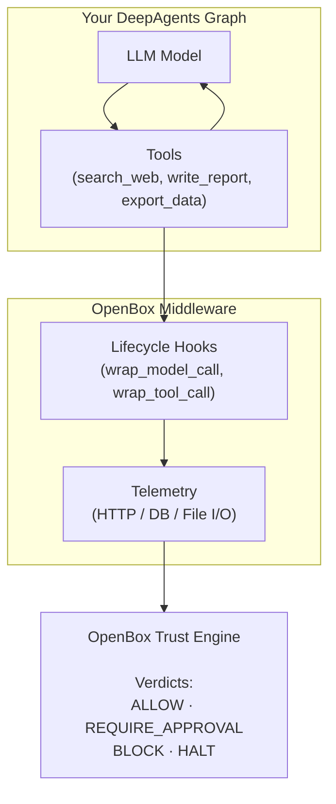

# Deep Agents SDK (Python)

The `openbox-deepagent-sdk-python` package provides real-time governance and observability for [DeepAgents](https://github.com/langchain-ai/deepagents). It builds on [`openbox-langgraph-sdk-python`](/developer-guide/langgraph) with middleware designed for DeepAgents tool dispatch, subagents, and built-in file tools.

| Guide | Description |
|-------|-------------|
| **[Integration Walkthrough](/developer-guide/deep-agents/integration-walkthrough)** | Step-by-step guide using the content builder demo |
| **[Configuration](/developer-guide/deep-agents/configuration)** | Environment variables and all middleware parameters |
| **[Error Handling](/developer-guide/deep-agents/error-handling)** | Handle governance decisions and failures in your code |
| **[Event Model](/developer-guide/deep-agents/event-model)** | How DeepAgents runs, model calls, tools, subagents, and telemetry appear in OpenBox |
| **[Approvals and Guardrails](/developer-guide/deep-agents/approvals-and-guardrails)** | Runtime enforcement behavior for verdicts, approvals, and guardrails |
| **[Telemetry](/developer-guide/deep-agents/telemetry)** | HTTP, database, file, and model telemetry behavior |
| **[Extending the Demo](/developer-guide/deep-agents/extending-the-demo-agent)** | Add your own tools, subagents, and skills |
| **[Demo Architecture](/developer-guide/deep-agents/demo-architecture)** | Middleware lifecycle, event flow, and subagent dispatch |
| **[Troubleshooting](/developer-guide/deep-agents/troubleshooting)** | Common issues and fixes for Deep Agents SDK setup |

:::info What the SDK Does
The SDK's primary job is to **connect your DeepAgents graph to OpenBox** and evaluate governance on every model call and tool call. All trust logic, policy evaluation, and UI management happens on the OpenBox platform — not in the SDK.
:::

## Philosophy

The SDK is intentionally minimal:

- **One middleware object** wraps your `create_deep_agent()` graph (`create_openbox_middleware`)
- **Zero graph changes** — your tools and graph structure stay exactly as they are
- **Automatic telemetry** — captures model calls, tool calls, subagent dispatch, HTTP, file I/O, and configured database operations via OpenTelemetry

## Installation

```bash
pip install openbox-deepagent-sdk-python

# Or with uv
uv add openbox-deepagent-sdk-python
```

If your project does not already install DeepAgents, include the optional runtime extra:

```bash
pip install "openbox-deepagent-sdk-python[deepagents]"
uv add "openbox-deepagent-sdk-python[deepagents]"
```

**Requires Python 3.11+** and `openbox-langgraph-sdk-python >= 0.2.0`.

## Factory Function

```python
from openbox_deepagent import create_openbox_middleware

def create_openbox_middleware(
    *,
    api_url: str,
    api_key: str,
    agent_name: str | None = None,
    agent_did: str | None = None,
    agent_private_key: str | None = None,
    known_subagents: list[str] | None = None,
    # + governance, instrumentation options
) -> OpenBoxMiddleware
```

Returns an `OpenBoxMiddleware` instance that implements the DeepAgents `AgentMiddleware` interface. Pass it to `create_deep_agent(middleware=[middleware])`.

See **[Configuration](/developer-guide/deep-agents/configuration)** for the full parameter list.

## Middleware Hooks

`OpenBoxMiddleware` implements 8 lifecycle hooks that DeepAgents calls at runtime. You do not call these directly — they fire automatically.

| Hook | When it fires | What OpenBox does |
|------|--------------|-------------------|
| `before_agent` | Before the agent graph runs | Records session start |
| `after_agent` | After the agent graph completes | Records session completion, finalizes telemetry |
| `wrap_model_call` | Before every LLM call | Runs prompt-side governance; sends `LLMStarted` event |
| `wrap_tool_call` | Before every tool execution | Evaluates governance policy; sends `ToolStarted` event |
| `abefore_agent` | Async variant of `before_agent` | Same as above, async-safe |
| `aafter_agent` | Async variant of `after_agent` | Same as above, async-safe |
| `awrap_model_call` | Async variant of `wrap_model_call` | Same as above, async-safe |
| `awrap_tool_call` | Async variant of `wrap_tool_call` | Same as above, async-safe |

Governance decisions (`ALLOW`, `BLOCK`, `HALT`, `REQUIRE_APPROVAL`) are evaluated inside `wrap_tool_call`. A `BLOCK` decision raises `GovernanceBlockedError` before the tool runs.

Newly created OpenBox agents require DID signing by default. Pass `agent_did` and `agent_private_key`, or set `OPENBOX_AGENT_DID` and `OPENBOX_AGENT_PRIVATE_KEY`, unless **Require signing** is disabled for the registered agent.

## What the SDK Captures

| Category | Details |
|----------|---------|
| **Model calls** | Prompts, completions, model name, token counts, latency |
| **Tool calls** | Tool name, input arguments, output, duration, governance decision |
| **HTTP calls** | Request/response bodies, headers, status codes, timing |
| **Database operations** | SQL queries from supported database instrumentation; pass `sqlalchemy_engine` for engines created before middleware initialization |
| **File I/O** | File paths and operations from DeepAgents built-in file tools and lower-level file spans |

:::note Subagent calls
DeepAgents supports subagents (e.g. `researcher`, `writer`). The SDK treats `task` dispatches as governed tool calls, annotates resolved subagent names, and labels those calls with tool type `a2a` when a subagent is detected.
:::

## HITL and DeepAgents Interrupts

DeepAgents has a built-in `interrupt_on` mechanism for pausing execution. OpenBox also provides Human-in-the-Loop (HITL) approvals via governance policies.

Avoid enabling both mechanisms for the same tool. The SDK enforces OpenBox approval verdicts, but it does not replace DeepAgents' own interrupt behavior. For OpenBox-governed deployments, use OpenBox policies for approval and remove matching tools from DeepAgents `interrupt_on`.

## How It Works


```mermaid
flowchart TD
    subgraph agent["Your DeepAgents Graph"]
        model["LLM Model"]
        tools["Tools<br/>(search_web, write_report, export_data)"]
        model --> tools
        tools --> model
    end

    subgraph middleware["OpenBox Middleware"]
        hooks["Lifecycle Hooks<br/>(wrap_model_call, wrap_tool_call)"]
        telemetry["Telemetry<br/>(HTTP / DB / File I/O)"]
    end

    tools --> hooks
    hooks --> telemetry
    telemetry --> engine

    engine["OpenBox Trust Engine<br/><br/>Verdicts:<br/>ALLOW · REQUIRE_APPROVAL<br/>BLOCK · HALT"]
```

## Configuration

See **[Configuration](/developer-guide/deep-agents/configuration)** for all options including:

- Environment variables
- Agent DID identity (`OPENBOX_AGENT_DID`, `OPENBOX_AGENT_PRIVATE_KEY`)
- Governance timeout and fail policies (`on_api_error`)
- Tool type mapping (`tool_type_map`, `skip_tool_types`)
- Event filtering flags
- Subagent classification (`known_subagents`)
- Database and file I/O instrumentation

## Next Steps

1. **[Integration Walkthrough](/developer-guide/deep-agents/integration-walkthrough)** — End-to-end setup with the content builder demo
2. **[Configuration](/developer-guide/deep-agents/configuration)** — All middleware parameters and environment variables
3. **[Error Handling](/developer-guide/deep-agents/error-handling)** — Handle governance decisions in your code
4. **[Event Model](/developer-guide/deep-agents/event-model)** — Understand session, activity, subagent, and telemetry events
5. **[Approvals and Guardrails](/developer-guide/deep-agents/approvals-and-guardrails)** — Configure runtime policy and HITL behavior
