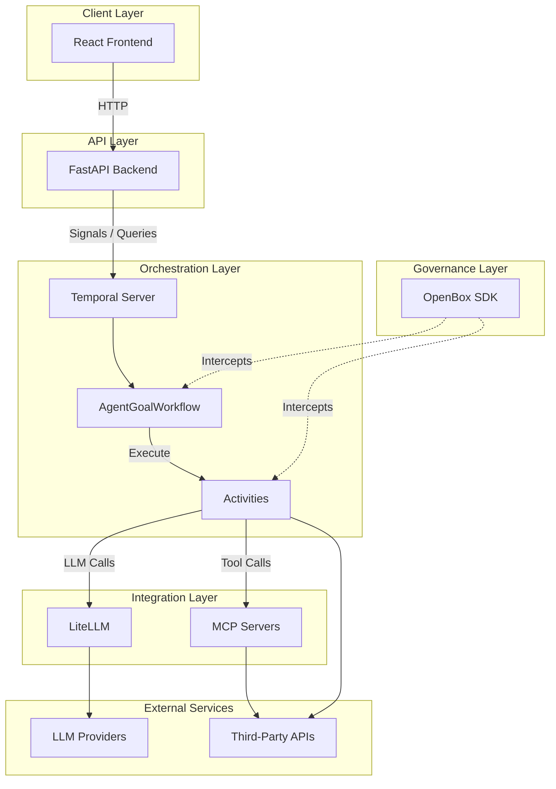
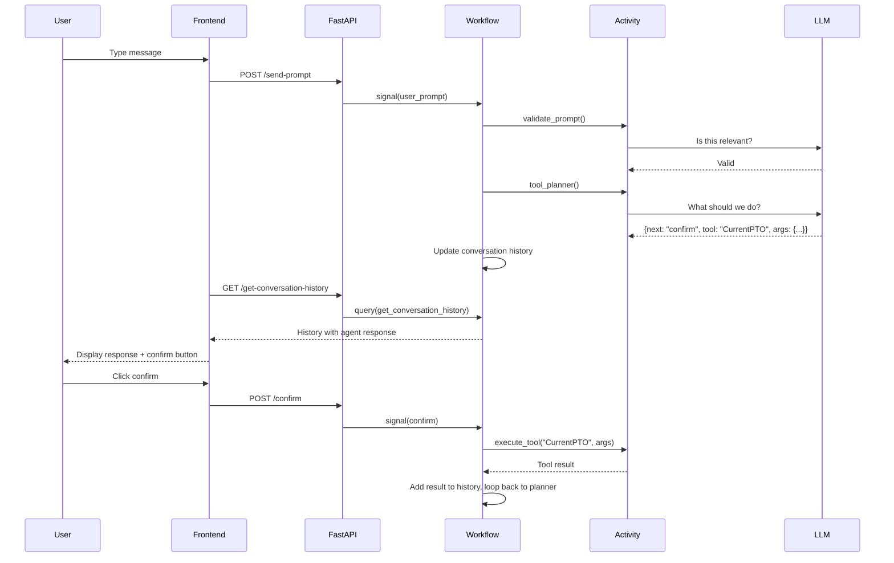

# Demo Architecture Reference

Quick reference for the [demo agent](https://github.com/OpenBox-AI/poc-temporal-agent) architecture. For setup, see the [Temporal Integration Guide](/developer-guide/temporal-integration-guide-python). For customization, see [Extending the Demo Agent](/developer-guide/customizing-your-agent).

## System Layers



| Layer | Technology | Role |
|-------|-----------|------|
| **Client** | React, Vite, Tailwind | Sends messages, displays responses, shows tool confirmations |
| **API** | FastAPI | Translates HTTP requests into Temporal signals and queries |
| **Orchestration** | Temporal | Runs the agent loop, executes tools via activities |
| **Integration** | LiteLLM, MCP | Multi-provider LLM calls, external tool servers |
| **Governance** | OpenBox SDK | Intercepts workflow and activity events for policy evaluation |
| **External** | OpenAI, Anthropic, Stripe, etc. | LLM providers and third-party APIs |

## Message Flow

1. User sends message → frontend POSTs to `/send-prompt`
2. FastAPI signals the Temporal workflow with `user_prompt`
3. Workflow calls `agent_validatePrompt` activity → LLM checks relevance to current goal
4. `generate_genai_prompt()` builds the system prompt (runs in workflow, no I/O)
5. Workflow calls `agent_toolPlanner` activity → LLM returns structured JSON
6. `next` field determines the path: `question`, `confirm`, `done`, or `pick-new-goal`
7. If `confirm` → frontend shows confirmation dialog → user clicks → POSTs to `/confirm`
8. Workflow calls `dynamic_tool_activity` → native handler or MCP server
9. Tool result added to conversation history → loop back to step 4



## Workflow

`AgentGoalWorkflow` in `workflows/agent_goal_workflow.py` — the main state machine that drives the agent.

### Signals

| Signal | Purpose |
|--------|---------|
| `user_prompt` | Delivers the user's message to the workflow |
| `confirm` | Tells the workflow the user approved a tool call |
| `end_chat` | Terminates the conversation |

### Queries

| Query | Returns |
|-------|---------|
| `get_conversation_history` | Full conversation as `ConversationHistory` |
| `get_agent_goal` | Current goal configuration as `AgentGoal` |
| `get_latest_tool_data` | Pending tool call data (if any) as `ToolData` |

### Continue-as-New

After 250 turns (`MAX_TURNS_BEFORE_CONTINUE`), the workflow starts a fresh execution, passing along the conversation summary and current state.

## Activities

Temporal requires workflow code to be deterministic — no network calls, randomness, or clock reads. All I/O runs as activities.

| Activity | File | Purpose |
|----------|------|---------|
| `agent_toolPlanner` | `activities/tool_activities.py` | Calls LLM via LiteLLM, returns structured JSON with the agent's next action |
| `agent_validatePrompt` | `activities/tool_activities.py` | Calls LLM to check if the user's message is relevant to the current goal |
| `dynamic_tool_activity` | `activities/tool_activities.py` | Dispatches tool calls to native handlers or MCP servers |

## LLM Response Format

`agent_toolPlanner` returns a structured JSON response from the LLM:

```json
{
  "response": "I'll look up your PTO balance. Can you confirm?",
  "next": "confirm",
  "tool": "CurrentPTO",
  "args": { "email": "bob@example.com" }
}
```

| Field | Type | Description |
|-------|------|-------------|
| `response` | `string` | Agent's message to the user |
| `next` | `string` | Next step — see values below |
| `tool` | `string \| null` | Tool to execute (if applicable) |
| `args` | `object \| null` | Tool arguments (if applicable) |

### `next` Values

| Value | Meaning |
|-------|---------|
| `question` | Agent needs more information — waits for next user message |
| `confirm` | Agent wants to run a tool — waits for user confirmation |
| `done` | Task complete — agent gives a final response |
| `pick-new-goal` | User wants to switch to a different agent/scenario |

## Prompt Generation

`generate_genai_prompt()` in `prompts/agent_prompt_generators.py` builds the system prompt. Runs directly in the workflow (deterministic, no I/O).

| Component | Source |
|-----------|--------|
| Agent role and persona | Hardcoded in prompt template |
| Goal description | `agent_goal.description` |
| Tool definitions | `agent_goal.tools` — name, description, arguments per tool |
| Conversation history | `conversation_history` — full message list |
| Response format schema | JSON schema enforcing `{response, next, tool, args}` |
| Example interactions | `agent_goal.example_conversation_history` |

## Tool Dispatch

`dynamic_tool_activity` routes tool calls based on handler lookup:

| Step | Logic |
|------|-------|
| 1. Native check | `get_handler(tool_name)` in `tools/__init__.py` — if found, call handler directly |
| 2. MCP fallback | If `get_handler()` raises `ValueError`, start MCP server as stdio subprocess → `ClientSession` → `session.call_tool()` |

Both paths execute as Temporal activities — OpenBox automatically intercepts and governs them.

## API Endpoints

FastAPI layer in `api/main.py`:

| Method | Endpoint | Purpose |
|--------|----------|---------|
| `POST` | `/send-prompt` | Send a user message — starts the workflow if needed, then signals it |
| `POST` | `/confirm` | Signal tool confirmation |
| `POST` | `/end-chat` | Signal chat end |
| `POST` | `/start-workflow` | Start the workflow with the goal's starter prompt |
| `GET` | `/get-conversation-history` | Query conversation history from the running workflow |
| `GET` | `/tool-data` | Query current pending tool call data |
| `GET` | `/agent-goal` | Query current goal configuration |

The frontend polls `/get-conversation-history` to pick up new messages.

## OpenBox Governance

`create_openbox_worker` in `scripts/run_worker.py` wraps the Temporal worker with governance interceptors.

| Capability | Detail |
|------------|--------|
| Workflow events | Intercepts start, complete, fail, and signal events |
| Activity execution | Captures inputs and outputs of every activity |
| HTTP capture | OpenTelemetry instrumentation records outbound requests with full bodies |
| Policy evaluation | Each event evaluated against configured policies on the platform |
| Decisions | Every event gets a governance decision — approved, blocked, or flagged |

:::tip Zero agent-side code
All governance evaluation happens on the platform side, not in the agent code. The agent is unaware of what policies are configured — it just runs, and OpenBox observes and enforces.
:::

## Key Files

| Path | Purpose |
|------|---------|
| `scripts/run_worker.py` | Worker bootstrap — `create_openbox_worker` integration point |
| `api/main.py` | FastAPI endpoints — HTTP bridge to Temporal |
| `workflows/agent_goal_workflow.py` | `AgentGoalWorkflow` — main state machine |
| `workflows/workflow_helpers.py` | `is_mcp_tool()`, continue-as-new logic, tool dispatch helpers |
| `activities/tool_activities.py` | LLM activities, tool execution, MCP dispatch |
| `prompts/agent_prompt_generators.py` | `generate_genai_prompt()` — system prompt builder |
| `tools/__init__.py` | `get_handler()` — native tool registry |
| `tools/tool_registry.py` | `ToolDefinition` instances for each native tool |
| `goals/` | Goal definitions — one file per category |
| `goals/__init__.py` | Aggregates all goals into a single registry |
| `models/tool_definitions.py` | Dataclasses: `AgentGoal`, `ToolDefinition`, `ToolArgument`, `MCPServerDefinition` |
| `shared/mcp_config.py` | Predefined MCP server configurations |
