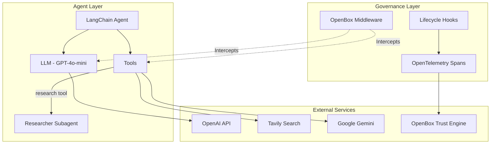
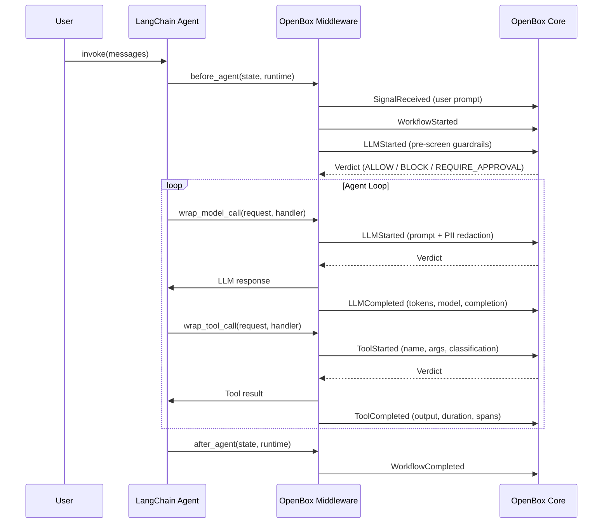
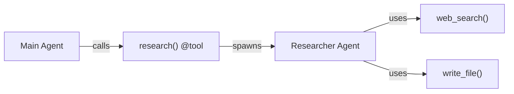

# Demo Architecture Reference

Quick reference for the [content builder agent](https://github.com/OpenBox-AI/openbox-langchain-sdk-python/tree/main/examples/content-builder-agent) architecture. For setup, see the [Integration Guide](/developer-guide/langchain-python/integration-walkthrough). For customization, see [Extending the Demo Agent](/developer-guide/langchain-python/extending-the-demo-agent).

## System Layers

| Layer | Technology | Role |
|-------|-----------|------|
| **Agent** | LangChain `create_agent` | Runs the agent loop, dispatches tools |
| **Governance** | OpenBox Middleware | Intercepts model and tool calls for policy evaluation |
| **External** | OpenAI, Tavily, Gemini, OpenBox | LLM providers, search, image generation, trust engine |

## Middleware Hooks Lifecycle

The `OpenBoxLangChainMiddleware` implements 4 async hooks (plus 4 sync variants) that LangChain calls at runtime:

### Hook Details

| Hook | When | What OpenBox Does |
|------|------|-------------------|
| `before_agent` | Before agent graph runs | Sends `SignalReceived`, `WorkflowStarted`, pre-screen `LLMStarted`; caches guardrails response |
| `wrap_model_call` | Before every LLM call | Runs PII redaction on prompt; sends `LLMStarted`/`LLMCompleted` with token counts |
| `wrap_tool_call` | Before every tool execution | Classifies tool type; sends `ToolStarted`/`ToolCompleted`; enforces verdict |
| `after_agent` | After agent graph completes | Sends `WorkflowCompleted`; cleans up span processor state |

## Governance Event Flow

Every agent invocation produces this sequence of events sent to OpenBox Core:

| # | Event | Trigger | Key Data |
|---|-------|---------|----------|
| 1 | `SignalReceived` | User prompt arrives | `signal_name: "user_prompt"`, prompt text |
| 2 | `WorkflowStarted` | Agent begins | Agent state, workflow ID, thread ID |
| 3 | `LLMStarted` | Pre-screen | User prompt for guardrails check |
| 4 | `LLMStarted` | Each model call | Prompt messages (after PII redaction) |
| 5 | `LLMCompleted` | Model responds | Token counts, model name, completion text, has_tool_calls |
| 6 | `ToolStarted` | Each tool call | Tool name, args, tool_type (if mapped) |
| 7 | `ToolCompleted` | Tool returns | Output, duration, OTel spans |
| 8 | `WorkflowCompleted` | Agent finishes | Final output, status |

### Verdict Enforcement

| Verdict | Behavior |
|---------|----------|
| `ALLOW` | Tool/LLM executes normally |
| `BLOCK` | `GovernanceBlockedError` raised — single tool blocked, agent may continue |
| `HALT` | `GovernanceHaltError` raised — entire session terminated |
| `REQUIRE_APPROVAL` | Middleware polls for human decision; proceeds or halts based on response |

## Subagent Pattern

Unlike the Deep Agents SDK which has native subagent support via the `task` tool, LangChain subagents are implemented as tool-wrapped functions:

1. The main agent calls the `research` tool
2. The `research` tool spawns a new `create_agent()` with its own tools
3. The subagent runs to completion and returns a summary
4. OpenBox governs the `research` tool call (ToolStarted/ToolCompleted)
5. The subagent's internal operations are **not** governed unless middleware is added to it

## Tool Classification

Tool types are resolved from `tool_type_map`:

| Priority | Source | Example |
|----------|--------|---------|
| 1 | `tool_type_map` (explicit) | `"web_search"` → `"http"` |
| 2 | `skip_tool_types` (exclusion) | `"read_file"` → skipped entirely |
| 3 | None (default) | `"generate_cover"` → governed by default policies |

Classified tools get `tool_type` in their `ToolStarted` event, enabling category-level Rego policies.

## Three-Layer Governance Architecture

The SDK implements governance at three layers:

| Layer | Component | What It Governs |
|-------|-----------|----------------|
| **Layer 1** | `AgentMiddleware` hooks | Agent lifecycle (before/after), model calls, tool execution |
| **Layer 2** | Hook Governance | HTTP requests, DB queries, file I/O at kernel boundary (via OTel) |
| **Layer 3** | Activity Context Mapping | Links hook traces to governance activities via OpenTelemetry |

### OpenTelemetry Instrumentation

The middleware uses a `WorkflowSpanProcessor` to capture HTTP calls, database queries, and file I/O during tool execution:

1. Before a tool runs, the middleware registers a trace context with the span processor
2. During tool execution, OTel auto-instrumentation captures outbound HTTP requests
3. After the tool completes, captured spans are attached to the `ToolCompleted` event
4. The span processor cleans up on `WorkflowCompleted`

This gives OpenBox visibility into what external calls each tool makes — not just the tool's input/output, but the actual HTTP requests to OpenAI, Tavily, etc.

## Pre-Screen Optimization

The first LLM call in each invocation reuses the pre-screen guardrails response from `before_agent`. This avoids a duplicate governance call:

1. `before_agent` sends `LLMStarted` with the user prompt → gets verdict + PII redaction
2. `wrap_model_call` detects `_first_llm_call=True` → reuses cached `_pre_screen_response`
3. Subsequent LLM calls go through the full governance path

## Sync and Async Execution

The middleware supports both sync and async execution:

- **Sync** (`agent.invoke()`, `agent.stream()`) — hooks delegate to async handlers via a thread pool executor
- **Async** (`agent.ainvoke()`, `agent.astream()`) — hooks call async handlers directly

The demo uses sync streaming (`agent.stream()`) with `stream_mode="values"` for real-time terminal output.

## Key Files

| Path | Purpose |
|------|---------|
| `content_writer.py` | Agent factory — `create_content_writer()` integration point |
| `AGENTS.md` | Brand voice and writing standards (loaded into system prompt) |
| `subagents.yaml` | Subagent definitions — name, description, tools |
| `skills/blog-post/SKILL.md` | Blog post workflow with research, structure, image generation |
| `skills/social-media/SKILL.md` | Social media workflow for LinkedIn and Twitter/X |

### SDK Source Files

| Path | Purpose |
|------|---------|
| `openbox_langchain/__init__.py` | Public API — re-exports errors, types, middleware |
| `openbox_langchain/middleware_factory.py` | `create_openbox_langchain_middleware()` factory function |
| `openbox_langchain/middleware.py` | `OpenBoxLangChainMiddleware` class — hooks and state management |
| `openbox_langchain/middleware_hook_handlers.py` | Hook handlers — before/after agent, wrap model call |
| `openbox_langchain/middleware_tool_hook.py` | Tool hook handler — wrap tool call |
| `openbox_langchain/middleware_hooks.py` | Event builders, PII redaction, OTel helpers |
