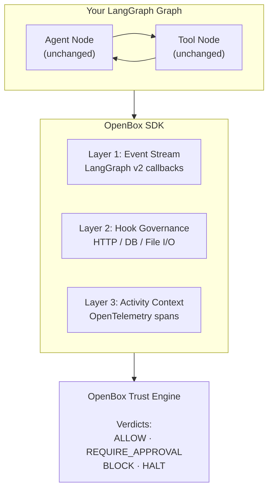

# LangGraph SDK (Python)

The OpenBox LangGraph SDK connects your compiled LangGraph graph to OpenBox. It handles event capture, telemetry collection, and trust evaluation with a single function call — no graph changes required.

| Guide | Description |
|-------|-------------|
| **[Configuration](/developer-guide/langgraph/configuration)** | Environment variables and handler parameters |
| **[Error Handling](/developer-guide/langgraph/error-handling)** | Handle governance decisions and failures in your code |

:::info What the SDK Does
The SDK's primary job is to **connect your LangGraph graph to OpenBox** and send LangGraph events to the platform. All trust logic, policies, and UI management happens on the platform — not in the SDK.
:::

## Philosophy

The SDK is intentionally minimal:

- **One function call** to wrap your compiled graph (`create_openbox_graph_handler`)
- **Zero graph changes** — keep writing LangGraph as normal; only the invocation changes
- **Automatic telemetry** — captures LangGraph v2 events, HTTP, database, and file I/O operations
- **3-layer governance** — event stream, hook interception, and OpenTelemetry spans work together

## Installation

**Package:** `openbox-langgraph-sdk-python`
**Requires:** Python 3.11+

```bash
uv add openbox-langgraph-sdk-python

# Or with pip
pip install openbox-langgraph-sdk-python
```

## Function Signature

```python
def create_openbox_graph_handler(
    graph: CompiledGraph,
    *,
    api_url: str,
    api_key: str,
    agent_name: str | None = None,
    # + governance, instrumentation, and handler options
) -> OpenBoxLangGraphHandler
```

Returns an `OpenBoxLangGraphHandler` that wraps your compiled graph with OpenBox interceptors, telemetry, and governance configured. The handler exposes the same `ainvoke`, `invoke`, and `astream` interface as the underlying graph.

See **[Configuration](/developer-guide/langgraph/configuration)** for the full parameter list.

## What the SDK Captures

The SDK automatically captures and sends to OpenBox:

### LangGraph Events
- Tool start / tool end (with inputs and outputs)
- Chat model start / chat model end (with prompts and responses)
- Node execution events (started, completed)
- Agent action and observation events

### HTTP Telemetry
- Request/response bodies (for LLM calls, external requests)
- Headers and status codes
- Request duration and timing

### Database Operations (Optional)
- SQL queries (PostgreSQL, MySQL, SQLite via SQLAlchemy)
- NoSQL operations (MongoDB, Redis)

### File I/O (Optional)
- File read/write operations
- File paths and sizes

All captured data is evaluated against your trust policies on the OpenBox platform.

## 3-Layer Governance

The SDK enforces governance at three layers simultaneously:

| Layer | Mechanism | What It Covers |
|-------|-----------|----------------|
| **Layer 1: Event Stream** | LangGraph v2 callback events | Tool calls, LLM invocations, node transitions |
| **Layer 2: Hook Governance** | Monkey-patched HTTP/DB/File hooks | External API calls, database queries, file operations |
| **Layer 3: Activity Context** | OpenTelemetry spans | Full distributed trace of every operation |



## Tracing

The `@traced` decorator wraps any function in an OpenTelemetry span so it appears in session replay. It works on both sync and async functions.

### Import

```python
from openbox_langgraph.tracing import traced
```

### Basic Usage

```python
@traced
def process_data(input_data):
    return transform(input_data)

@traced
async def fetch_data(url):
    return await http_get(url)
```

### With Options

```python
@traced(
    name="custom-span-name",
    capture_args=True,       # Capture function arguments (default: True)
    capture_result=True,     # Capture return value (default: True)
    capture_exception=True,  # Capture exception details on error (default: True)
    max_arg_length=2000,     # Max length for serialized arguments (default: 2000)
)
async def process_sensitive_data(data):
    return await handle(data)
```

## Streaming

The handler exposes `astream_governed()` for token-by-token streaming with governance applied at each step:

```python
governed = create_openbox_graph_handler(
    graph=app,
    api_url=os.getenv("OPENBOX_URL"),
    api_key=os.getenv("OPENBOX_API_KEY"),
    agent_name="MyAgent",
)

async for chunk in governed.astream_governed(
    {"messages": [("user", "Hello")]},
    stream_mode="values",
):
    print(chunk)
```

Governance events fire between chunks — a BLOCK verdict raises `GovernanceBlockedError` mid-stream. See **[Error Handling](/developer-guide/langgraph/error-handling)** for handling patterns.

## Next Steps

1. **[Configuration](/developer-guide/langgraph/configuration)** — Configure timeouts, fail policies, and exclusions
2. **[Error Handling](/developer-guide/langgraph/error-handling)** — Handle governance decisions in your code
3. **[Getting Started](/getting-started/langgraph)** — Wrap an existing LangGraph agent in 5 minutes
