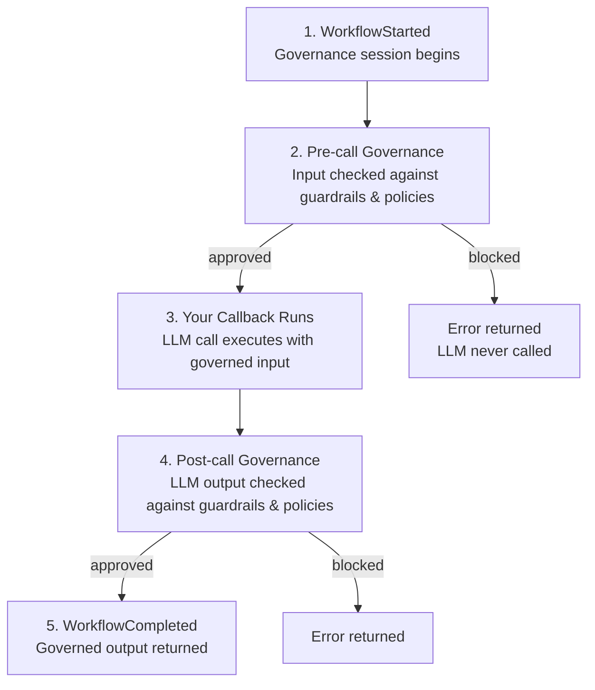

# n8n Integration Guide

Reference for the OpenBox n8n integration — the governance pipeline, configuration options, error handling, and additional examples.

:::tip Just getting started?
**[Run the n8n Demo](/getting-started/run-the-n8n-demo)** for a hands-on walkthrough, or **[Wrap an Existing n8n Workflow](/getting-started/wrap-an-existing-n8n-workflow)** to add governance to your own workflow.
:::

## Prerequisites

- Completed the [n8n demo](/getting-started/run-the-n8n-demo) or [wrapped an existing workflow](/getting-started/wrap-an-existing-n8n-workflow)
- An **OpenBox API key**. [Register an agent](/dashboard/agents/registering-agents) in the OpenBox Dashboard to obtain one.

## OpenAI Example

Same pattern as the Ollama example in the getting-started guide, with a different LLM call inside the callback:

```javascript
async (governed) => {
  const prompt = governed.message ?? userMessage;
  const response = await this.helpers.httpRequest({
    method: 'POST',
    url: 'https://api.openai.com/v1/chat/completions',
    headers: { Authorization: 'Bearer ' + openaiKey },
    body: {
      model: 'gpt-4o',
      messages: [
        { role: 'system', content: systemPrompt },
        { role: 'user', content: prompt },
      ],
    },
  });
  return { text: response.choices[0].message.content };
}
```

The `govern()` wrapper stays the same — just swap the LLM call in the callback.

## How It Works

`govern()` wraps your LLM call through a 5-stage pipeline:



**Verdicts** at each checkpoint:

| Verdict | Behavior |
|---------|----------|
| `allow` | Proceeds unmodified |
| `constrain` | Input or output is redacted; call proceeds with cleaned data |
| `require_approval` | Pauses until a human approves via the dashboard |
| `block` | Terminated, error returned |
| `halt` | Call and enclosing workflow terminated |

What gets checked at each stage is configured in the [OpenBox Dashboard](https://platform.openbox.ai) — no code changes needed.

## Configuration Reference

Options passed to `govern()`:

| Option | Default | Description |
|--------|---------|-------------|
| `apiKey` | **Required** | Your OpenBox API key (`obx_live_*` or `obx_test_*`) |
| `apiEndpoint` | `https://core.openbox.ai` | OpenBox Core base URL |
| `activityType` | `DefaultActivity` | Must match the dashboard config |
| `governancePolicy` | `fail_open` | Set to `fail_closed` to block when Core is unreachable |
| `apiTimeout` | `30` | Request timeout in seconds |
| `hitlEnabled` | `false` | Enable human-in-the-loop approval |
| `hitlPollInterval` | `5` | Polling interval in seconds while waiting for approval |
| `hitlMaxWait` | `300` | Maximum wait time for approval in seconds |
| `skipWorkflowTypes` | none | Workflow names exempt from governance |
| `skipActivityTypes` | none | Activity types exempt from governance |

## Error Handling

When governance blocks a request, the user sees an error. Possible outcomes:

| Error | Cause |
|-------|-------|
| `GuardrailsValidationError` | Input or output failed a check (PII, toxicity, etc.) |
| `GovernanceBlockedError` | A policy rule blocked the action |
| `ApprovalExpiredError` | HITL request timed out |
| `ApprovalRejectedError` | A human reviewer rejected the request |
| `ApprovalDisabledError` | Verdict requires approval but HITL is not enabled |

To catch these in code:

```javascript
const {
  GovernanceBlockedError,
  GuardrailsValidationError,
  ApprovalExpiredError,
  ApprovalRejectedError,
  ApprovalDisabledError,
} = require('openbox');

try {
  const { output } = await govern(transport, config, workflow, input, callback);
} catch (err) {
  if (err instanceof GuardrailsValidationError) { /* guardrail failed */ }
  if (err instanceof GovernanceBlockedError) { /* policy blocked */ }
  if (err instanceof ApprovalExpiredError) { /* HITL timed out */ }
  if (err instanceof ApprovalRejectedError) { /* HITL rejected */ }
  if (err instanceof ApprovalDisabledError) { /* HITL not enabled */ }
}
```

## Next Steps

1. **[Configure guardrails](/trust-lifecycle/authorize/guardrails)** — PII detection, toxicity filtering, banned terms, content classification
2. **[Set up policies](/trust-lifecycle/authorize/policies)** — authorization rules, risk thresholds, data classification
3. **[Enable approvals](/approvals)** — human-in-the-loop workflows for sensitive operations
4. **[View sessions](/trust-lifecycle/session-replay)** — monitor governed interactions in the dashboard event timeline
5. **[SDK Reference](/developer-guide/sdk-reference)** — full API surface and supported engines
