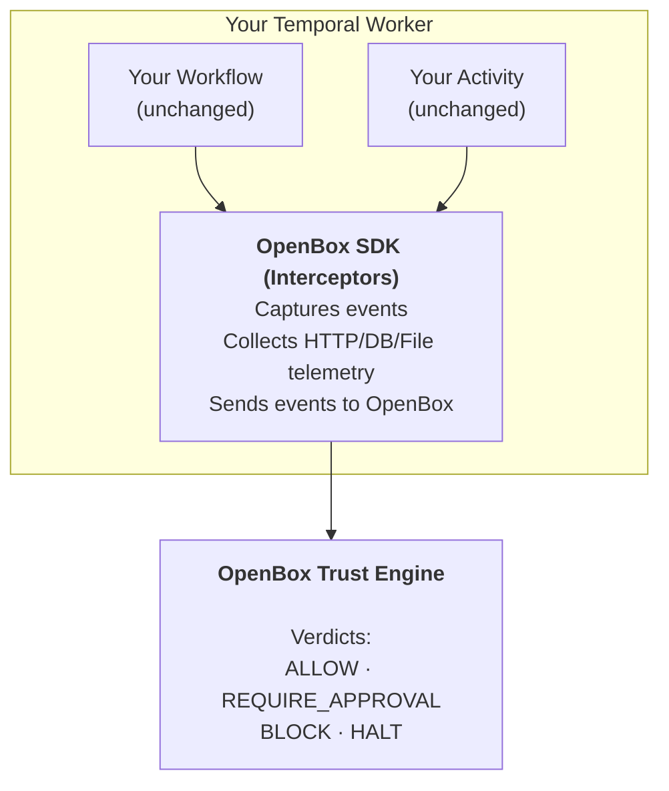

# SDK Reference

The OpenBox SDK integrates with Temporal workflows. It handles event capture, telemetry collection, and trust evaluation with a single function call.

:::info What the SDK Does
The SDK's primary job is to **wrap your Temporal worker** and send workflow/activity events to the OpenBox platform. All trust logic, policies, and UI management happens on the platform — not in the SDK.
:::

## Philosophy

The SDK is intentionally minimal:

- **One function call** to wrap your worker (`create_openbox_worker`)
- **Zero code changes** to workflow/activity logic. Worker initialization requires adding OpenBox wrapper (~5 lines).
- **Automatic telemetry** - captures HTTP, database, and file I/O operations

## Supported Engines

| Engine | Language | Status |
|--------|----------|--------|
| Temporal | Python | ✅ Supported |

## Installation and Setup

See:

1. **[Wrap an Existing Agent](/getting-started/wrap-an-existing-agent)** - Wrap an existing Temporal worker
2. **[Temporal (Python)](/developer-guide/temporal-integration-guide-python)** - End-to-end setup from scratch
3. **[Configuration](/developer-guide/configuration)** - All SDK options for `create_openbox_worker`

## Function Signature

```python
def create_openbox_worker(
    client: Client,
    task_queue: str,
    *,
    workflows: Sequence[Type] = (),
    activities: Sequence[Callable] = (),
    openbox_url: str,
    openbox_api_key: str,
    # + governance, instrumentation, and Temporal Worker options
)
```

Returns a standard Temporal `Worker` with OpenBox interceptors, telemetry, and governance configured. All [Temporal Worker options](https://python.temporal.io/temporalio.worker.Worker.html) are passed through.

See **[Configuration](/developer-guide/configuration)** for the full parameter list.

## What the SDK Captures

The SDK automatically captures and sends to OpenBox:

### Workflow Events
- Workflow started/completed/failed
- Signal received
- Query executed

### Activity Events
- Activity started (with input)
- Activity completed (with output and duration)
- Activity failed (with error)

### HTTP Telemetry
- Request/response bodies (for LLM calls, external requests)
- Headers and status codes
- Request duration and timing

### Database Operations (Optional)
- SQL queries (PostgreSQL, MySQL)
- NoSQL operations (MongoDB, Redis)

### File I/O (Optional)
- File read/write operations
- File paths and sizes

All captured data is evaluated against your trust policies on the OpenBox platform.

## Tracing

The `@traced` decorator wraps any function in an OpenTelemetry span so it appears in session replay. It works on both sync and async functions.

### Import

```python
from openbox.tracing import traced
```

### Basic Usage

```python
@traced
def process_data(input_data):
    return transform(input_data)

@traced
async def fetch_data(url):
    return await http_get(url)
```

### With Options

```python
@traced(
    name="custom-span-name",
    capture_args=True,       # Capture function arguments (default: True)
    capture_result=True,     # Capture return value (default: True)
    capture_exception=True,  # Capture exception details on error (default: True)
    max_arg_length=2000,     # Max length for serialized arguments (default: 2000)
)
async def process_sensitive_data(data):
    return await handle(data)
```

### Manual Spans

For more control, use `create_span` as a context manager:

```python
from openbox.tracing import create_span

with create_span("my-operation", {"input": data}) as span:
    result = do_something()
    span.set_attribute("output", result)
```

## How It Works



## Configuration

See **[Configuration](/developer-guide/configuration)** for all options including:
- Environment variables
- Governance timeout and fail policies
- Event filtering (skip workflows/activities)
- Database and file I/O instrumentation

## Next Steps

1. **[Temporal Integration](/developer-guide/temporal-integration-guide-python)** - Wrap an existing Temporal agent with the SDK
2. **[Configuration](/developer-guide/configuration)** - Configure timeouts, fail policies, and exclusions
3. **[Error Handling](/developer-guide/error-handling)** - Handle governance decisions in your code
