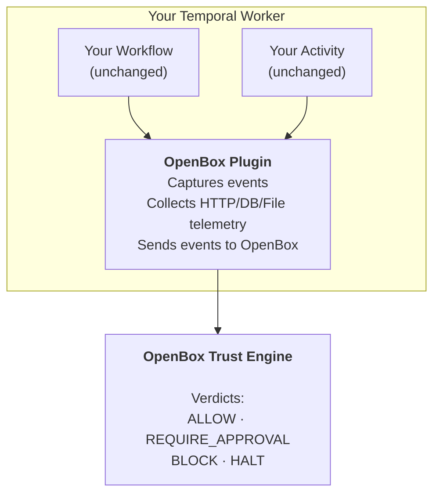

# Temporal Plugin (Python)

`OpenBoxPlugin` is a drop-in Temporal plugin that adds governance and observability to your workers.

| Guide | Description |
|-------|-------------|
| **[Integration Walkthrough](/developer-guide/temporal-python/integration-walkthrough)** | Step-by-step guide for adding OpenBox to Temporal workers |
| **[Configuration](/developer-guide/temporal-python/configuration)** | Plugin options and environment variables |
| **[Error Handling](/developer-guide/temporal-python/error-handling)** | Handle governance decisions and failures in your code |
| **[Customizing the Demo](/developer-guide/temporal-python/customizing-the-demo)** | Tailor governance behavior to your agent's needs |
| **[Demo Architecture](/developer-guide/temporal-python/demo-architecture)** | Architecture of the reference demo application |
| **[Troubleshooting](/developer-guide/temporal-python/troubleshooting)** | Common issues and fixes for Temporal plugin setup |

:::info What the Plugin Does
The plugin's primary job is to **connect your Temporal worker to OpenBox** and send workflow/activity events to the platform. All trust logic, policies, and UI management happens on the platform — not in the plugin.
:::

## Philosophy

The plugin is intentionally minimal:

- **One plugin** added to your existing Worker — no import swaps or wrapper functions
- **Zero code changes** to workflow/activity logic
- **Automatic telemetry** — captures HTTP, database, and file I/O operations
- **Composable** — works alongside other Temporal plugins (e.g., `OpenTelemetryPlugin`)

## Supported Engines

| Engine | Language | Status |
|--------|----------|--------|
| Temporal | Python | ✅ Supported |
| n8n | JavaScript | ✅ Supported |

## Installation and Setup

See:

1. **[Wrap an Existing Agent](/getting-started/temporal/wrap-an-existing-agent)** — Add OpenBox to an existing Temporal worker
2. **[Temporal (Python)](/developer-guide/temporal-python/integration-walkthrough)** — End-to-end setup from scratch
3. **[Configuration](/developer-guide/temporal-python/configuration)** — All plugin options

## Plugin Usage

```python
from openbox.plugin import OpenBoxPlugin

OpenBoxPlugin(
    openbox_url: str,
    openbox_api_key: str,
    # + governance, instrumentation options
)
```

Add it to your Worker's `plugins` list:

```python
worker = Worker(
    client,
    task_queue="my-task-queue",
    workflows=[MyWorkflow],
    activities=[my_activity],
    plugins=[OpenBoxPlugin(
        openbox_url=os.getenv("OPENBOX_URL"),
        openbox_api_key=os.getenv("OPENBOX_API_KEY"),
    )],
)
```

The plugin automatically configures governance interceptors, OTel instrumentation, sandbox passthrough, and the `send_governance_event` activity.

See **[Configuration](/developer-guide/temporal-python/configuration)** for the full parameter list.

## What the Plugin Captures

The plugin automatically captures and sends to OpenBox:

### Workflow Events
- Workflow started/completed/failed
- Signal received
- Query executed

### Activity Events
- Activity started (with input)
- Activity completed (with output and duration)
- Activity failed (with error)

### HTTP Telemetry
- Request/response bodies (for LLM calls, external requests)
- Headers and status codes
- Request duration and timing

### Database Operations (Optional)
- SQL queries (PostgreSQL, MySQL)
- NoSQL operations (MongoDB, Redis)

### File I/O (Optional)
- File read/write operations
- File paths and sizes

All captured data is evaluated against your trust policies on the OpenBox platform.

## Tracing

The `@traced` decorator wraps any function in an OpenTelemetry span so it appears in session replay. It works on both sync and async functions.

### Import

```python
from openbox.tracing import traced
```

### Basic Usage

```python
@traced
def process_data(input_data):
    return transform(input_data)

@traced
async def fetch_data(url):
    return await http_get(url)
```

### With Options

```python
@traced(
    name="custom-span-name",
    capture_args=True,       # Capture function arguments (default: True)
    capture_result=True,     # Capture return value (default: True)
    capture_exception=True,  # Capture exception details on error (default: True)
    max_arg_length=2000,     # Max length for serialized arguments (default: 2000)
)
async def process_sensitive_data(data):
    return await handle(data)
```

### Manual Spans

For more control, use `create_span` as a context manager:

```python
from openbox.tracing import create_span

with create_span("my-operation", {"input": data}) as span:
    result = do_something()
    span.set_attribute("output", result)
```

## How It Works



## Configuration

See **[Configuration](/developer-guide/temporal-python/configuration)** for all options including:
- Environment variables
- Governance timeout and fail policies
- Event filtering (skip workflows/activities)
- Database and file I/O instrumentation

## Next Steps

1. **[Temporal Integration](/developer-guide/temporal-python/integration-walkthrough)** - Add OpenBox to an existing Temporal agent
2. **[Configuration](/developer-guide/temporal-python/configuration)** - Configure timeouts, fail policies, and exclusions
3. **[Error Handling](/developer-guide/temporal-python/error-handling)** - Handle governance decisions in your code
