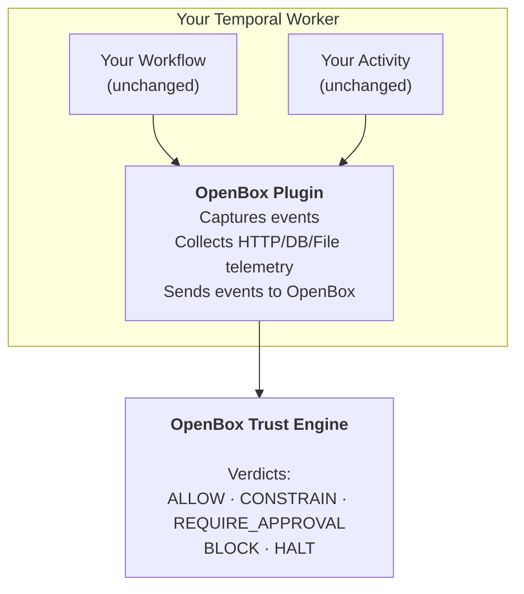

# Temporal Plugin (Python)

`OpenBoxPlugin` is the sole public OpenBox integration entry point for Temporal Python. Add it to the native Worker's `plugins` list for governance, observability, and optional governed sandbox commands.

| Guide | Description |
|-------|-------------|
| **[Integration Walkthrough](/developer-guide/temporal-python/integration-walkthrough)** | Step-by-step guide for adding OpenBox to Temporal workers |
| **[Configuration](/developer-guide/temporal-python/configuration)** | Plugin options and environment variables |
| **[Error Handling](/developer-guide/temporal-python/error-handling)** | Handle governance decisions and failures in your code |
| **[Governed Sandbox Commands](/developer-guide/temporal-python/concept)** | Register one-attempt commands for enforced sandbox execution |
| **[Customizing the Demo](/developer-guide/temporal-python/customizing-the-demo)** | Tailor governance behavior to your agent's needs |
| **[Demo Architecture](/developer-guide/temporal-python/demo-architecture)** | Architecture of the reference demo application |
| **[Troubleshooting](/developer-guide/temporal-python/troubleshooting)** | Common issues and fixes for Temporal plugin setup |

:::info What the Plugin Does
The plugin's primary job is to **connect your Temporal worker to OpenBox** and send workflow/activity events to the platform. All trust logic, policies, and UI management happens on the platform. It does not happen in the plugin.
:::

## Philosophy

The plugin is intentionally minimal:

- **One plugin** added to your existing native Worker
- **Plugin-owned setup** for Worker interception, Workflows, and Activities
- **Zero OpenBox setup** in Workflow and Activity code
- **One sandbox option** on the same plugin for governed command interception
- **Automatic telemetry**: captures HTTP, database, and file I/O operations
- **Composable**: works alongside other Temporal plugins (e.g., `OpenTelemetryPlugin`)

## Supported Engines

| Engine | Language | Status |
|--------|----------|--------|
| Temporal | Python | ✅ Supported |
| n8n | JavaScript | ✅ Supported |

## Installation and Setup

See:

1. **[Wrap an Existing Agent](/getting-started/temporal/wrap-an-existing-agent)**: Add OpenBox to an existing Temporal worker
2. **[Temporal (Python)](/developer-guide/temporal-python/integration-walkthrough)**: End-to-end setup from scratch
3. **[Configuration](/developer-guide/temporal-python/configuration)**: All plugin options

## Plugin Usage

```python
from openbox import OpenBoxPlugin
from openbox.sandbox import SandboxConfig

OpenBoxPlugin(
    openbox_url: str,
    openbox_api_key: str,
    sandbox: SandboxConfig | None = None,
    # + governance and instrumentation options
)
```

Add it to your Worker's `plugins` list:

```python
worker = Worker(
    client,
    task_queue="my-task-queue",
    workflows=[MyWorkflow],
    activities=[my_activity],
    plugins=[OpenBoxPlugin(
        openbox_url=os.getenv("OPENBOX_URL"),
        openbox_api_key=os.getenv("OPENBOX_API_KEY"),
    )],
)
```

The plugin internally owns governance interceptors, OTel instrumentation, Workflow sandbox passthrough, and OpenBox lifecycle reporting. Supplying `sandbox=SandboxConfig(...)` on that same initializer enables governed-command interception for registered user Activities; see [Governed Sandbox Commands](/developer-guide/temporal-python/concept).

See **[Configuration](/developer-guide/temporal-python/configuration)** for the full parameter list.

## What the Plugin Captures

The plugin automatically captures and sends to OpenBox:

### Workflow Events
- Workflow started/completed/failed
- Signal received
- Query executed

### Activity Events
- Activity started (with input)
- Activity completed (with output and duration)
- Activity failed (with error)

### HTTP Telemetry
- Request/response bodies (for LLM calls, external requests)
- Headers and status codes
- Request duration and timing

### Database Operations (Optional)
- SQL queries (PostgreSQL, MySQL)
- NoSQL operations (MongoDB, Redis)

### File I/O (Optional)
- File read/write operations
- File paths and sizes

All captured data is evaluated against your trust policies on the OpenBox platform.

## Tracing

The `@traced` decorator wraps any function in an OpenTelemetry span so it appears in session replay. It works on both sync and async functions.

### Import

```python
from openbox.tracing import traced
```

### Basic Usage

```python
@traced
def process_data(input_data):
    return transform(input_data)

@traced
async def fetch_data(url):
    return await http_get(url)
```

### With Options

```python
@traced(
    name="custom-span-name",
    capture_args=True,       # Capture function arguments (default: True)
    capture_result=True,     # Capture return value (default: True)
    capture_exception=True,  # Capture exception details on error (default: True)
    max_arg_length=2000,     # Max length for serialized arguments (default: 2000)
)
async def process_sensitive_data(data):
    return await handle(data)
```

### Manual Spans

For more control, use `create_span` as a context manager:

```python
from openbox.tracing import create_span

with create_span("my-operation", {"input": data}) as span:
    result = do_something()
    span.set_attribute("output", result)
```

## How It Works


```mermaid
flowchart TD
    subgraph worker["Your Temporal Worker"]
        workflow["Your Workflow<br/>(unchanged)"]
        activity["Your Activity<br/>(unchanged)"]
        sdk["<b>OpenBox Plugin</b><br/>Captures events<br/>Collects HTTP/DB/File telemetry<br/>Sends events to OpenBox"]
        workflow --> sdk
        activity --> sdk
    end

    sdk --> engine

    engine["<b>OpenBox Trust Engine</b><br/><br/>Verdicts:<br/>ALLOW · CONSTRAIN · REQUIRE_APPROVAL<br/>BLOCK · HALT"]
```

## Governed-command API

| Symbol | Import | Purpose |
|---|---|---|
| `OpenBoxPlugin` | `openbox.plugin` | Sole Temporal integration entry point |
| `SandboxConfig` | `openbox.sandbox.config` | Configure registered governed commands through `OpenBoxPlugin(..., sandbox=...)` |
| `GovernedCommandRegistry` and typed definitions | `openbox.sandbox` | Define bounded command profiles and typed results |

Only registered governed commands can enforce `CONSTRAIN` through sandbox execution. Policy routing uses `constraints: ["run_in_sandbox"]`; a behavioral `CONSTRAIN` can select a registered replacement profile and abort the triggering host action. An ordinary Temporal action that receives an unsupported `CONSTRAIN` fails closed rather than continuing as if it received `ALLOW`. The plugin owns bounded history conversion, output mapping, and cancellation cleanup, while the dispatcher enforces at-most-once dispatch per dispatch ID.

The sandbox runtime defaults to the `native` provider (`sandbox-exec` on macOS, bubblewrap on Linux). See **[Governed Sandbox Commands](/developer-guide/temporal-python/concept)** for plugin composition, provisioning, runtime evidence, and zero-host requirements.

## Configuration

See **[Configuration](/developer-guide/temporal-python/configuration)** for all options including:
- Environment variables
- Governance timeout and fail policies
- Event filtering (skip workflows/activities)
- Database and file I/O instrumentation

## Next Steps

1. **[Temporal Integration](/developer-guide/temporal-python/integration-walkthrough)** - Add OpenBox to an existing Temporal agent
2. **[Configuration](/developer-guide/temporal-python/configuration)** - Configure timeouts, fail policies, and exclusions
3. **[Governed Sandbox Commands](/developer-guide/temporal-python/concept)** - Enforce constrained registered commands in isolation
4. **[Error Handling](/developer-guide/temporal-python/error-handling)** - Handle governance decisions in your code
