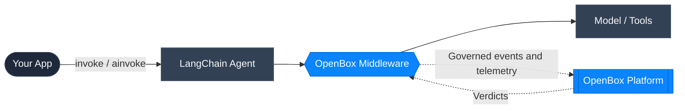

# LangChain 101

OpenBox plugs into [LangChain](https://www.langchain.com/) through LangChain
agent middleware. This page covers the LangChain concepts you will see in the
OpenBox docs and shows how each one maps to governance and telemetry.

## Concepts At A Glance

### Agent

A LangChain **agent** coordinates model reasoning and tool execution.

**OpenBox connection:** Governed agents appear in OpenBox as run-like sessions.
The SDK emits lifecycle events for the run and associates model and tool events
with that execution.

### Model Call

A **model call** is a request from the agent to an LLM provider.

**OpenBox connection:** Model calls are governed through `LLMStarted` and
`LLMCompleted` events. OpenBox can evaluate prompts before the model runs and
responses after the model returns.

### Tool

A LangChain **tool** is a callable capability the agent can execute, such as web
search, database lookup, file access, or an external API call.

**OpenBox connection:** Tools are governed through `ToolStarted` and
`ToolCompleted` events. These are the main boundaries for live approvals,
input/output guardrails, and tool health metrics.

### Middleware

LangChain **middleware** wraps agent lifecycle, model calls, and tool calls.

**OpenBox connection:** The OpenBox middleware is the integration point. It
sends governed events and telemetry to OpenBox, receives verdicts, and enforces
those verdicts at runtime.

## Where OpenBox Sits In The Flow

- Your application invokes the LangChain agent.
- OpenBox middleware intercepts agent, model, and tool boundaries.
- OpenBox evaluates policy, approvals, and guardrails, then returns a verdict.
- Execution continues, waits for approval, or stops based on that verdict.

## Why This Matters In The UI

These runtime distinctions explain common operator questions:

- Model calls show up as LLM lifecycle events.
- Tool calls show up as governed tool events.
- Agent prompts are captured as signal-style context.
- Tool health is visible only for agents that actually execute tools.
- Token usage appears when the model provider returns usage metadata.

## Next Steps

- [Wrap an Existing Agent](/getting-started/langchain/wrap-an-existing-agent)
- [LangChain SDK (Python)](/developer-guide/langchain)
- [LangChain Event Model](/developer-guide/langchain/event-model)
