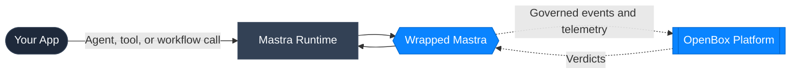

# Mastra 101

OpenBox plugs into [Mastra](https://mastra.ai/) at runtime startup. This page covers the Mastra concepts you will see in the OpenBox docs and shows how each one maps to governance and telemetry.

## Concepts At A Glance

### Agent

A Mastra **Agent** is the runtime component that handles user input, model generation, and optional tool usage.

**OpenBox connection:** Wrapped agents appear in OpenBox as workflow-like runs. They emit lifecycle events and agent signals such as `user_input` and `agent_output`.

### Tool

A Mastra **Tool** is a callable capability the agent or workflow can execute, such as writing a file, querying a system, or calling an external service.

**OpenBox connection:** Wrapped tools are governed as activities. OpenBox evaluates `ActivityStarted` and `ActivityCompleted`, which makes tools the main path for live approvals and input/output guardrails.

### Workflow

A Mastra **Workflow** orchestrates multiple steps and can combine agent calls, tools, and non-tool business logic.

**OpenBox connection:** Wrapped workflows emit `WorkflowStarted`, `WorkflowCompleted`, and `WorkflowFailed`. Non-tool workflow steps can also become governed activities.

### Signals

The Mastra SDK also emits **signals** for agent lifecycle and workflow resume paths.

**OpenBox connection:** Signals are how agent prompts, resume events, and agent output are represented. This is important because agent-only model work appears on the signal path, not as a standalone tool activity.

## Where OpenBox Sits In The Flow

- Your application calls into the Mastra runtime.
- The wrapped Mastra layer sends boundary events and telemetry to OpenBox.
- OpenBox evaluates policy, approvals, and guardrails, then returns a verdict.
- Execution continues, pauses, or stops based on that verdict.

## Why This Matters In The UI

These runtime distinctions explain common operator questions:

- Tool calls show up as activities.
- Agent prompts show up as signals, not activities.
- Agent-only model usage appears on the agent signal and workflow summary path.
- Tool health is visible only for agents that actually execute tools.

## Next Steps

- [Run the Demo](/getting-started/mastra/run-the-demo)
- [Wrap an Existing Agent](/getting-started/mastra/wrap-an-existing-agent)
- [Mastra SDK (TypeScript)](/developer-guide/mastra)
