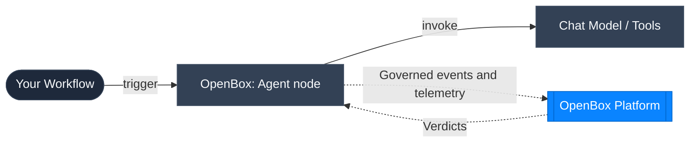

# n8n 101

OpenBox plugs into [n8n](https://n8n.io/) through **OpenBox: Agent**, a
community node that ports the same governance middleware used by the OpenBox
LangChain SDK directly into n8n's node runtime. This page covers the n8n
concepts you will see in the OpenBox docs and shows how each one maps to
governance and telemetry.

## Concepts At A Glance

### Agent

In n8n, an **agent** is an AI Agent–style node that coordinates model
reasoning and tool execution: it takes a prompt, calls a connected Chat
Model, decides whether to call a Tool, and loops until it has a final
response.

**OpenBox connection:** The **OpenBox: Agent** node is a drop-in replacement
for n8n's standard AI Agent node. Each node execution becomes a run-like
session in OpenBox. The node emits lifecycle events for that run and
associates model and tool events with it.

### Model Call

A **model call** is the request the agent node sends to whatever **Chat
Model** sub-node is connected to it — OpenAI Chat Model, Anthropic Chat
Model, and others.

**OpenBox connection:** Model calls are governed through `LLMStarted` and
`LLMCompleted` events. OpenBox can evaluate the prompt before the model runs
and the response after the model returns.

### Tool

A **tool** is a Tool sub-node connected to the agent's Tool input — an HTTP
Request Tool, Code Tool, Vector Store Tool, or any other callable capability
the agent can invoke.

**OpenBox connection:** Tools are governed through `ToolStarted` and
`ToolCompleted` events. These are the main boundaries for live approvals,
input/output guardrails, and tool health metrics.

### Middleware

In LangChain's Python runtime, middleware wraps the agent lifecycle, model
calls, and tool calls. n8n has no equivalent middleware hook API for nodes.

**OpenBox connection:** instead of an injected middleware object, the same
governance logic ships built directly into the **OpenBox: Agent** node — a
1:1 TypeScript port of the LangChain middleware. The node's execution
function is the integration point: it sends governed events and telemetry to
OpenBox, receives verdicts, and enforces those verdicts at runtime.

## Where OpenBox Sits In The Flow

- Your workflow trigger runs the **OpenBox: Agent** node.
- The node intercepts the agent, model, and tool boundaries as it runs its loop.
- OpenBox evaluates policy, approvals, and guardrails, then returns a verdict.
- Execution continues, waits for approval, or stops based on that verdict.

## Why This Matters In The UI

These runtime distinctions explain common operator questions:

- Model calls show up as LLM lifecycle events tied to the connected Chat Model sub-node.
- Tool calls show up as governed tool events, one per connected Tool sub-node invocation.
- The user prompt — from a Chat Trigger or the node's Prompt field — is captured as signal-style context.
- Tool health is visible only for agents that actually have Tool sub-nodes connected and invoked.
- Token usage appears when the connected Chat Model returns usage metadata.

## Next Steps

- [Wrap an Existing Agent](/getting-started/n8n/wrap-an-existing-agent)
- [n8n Node Reference](/developer-guide/n8n)
- [n8n Event Model](/developer-guide/n8n/event-model)
