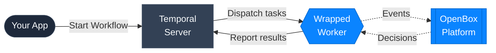

# Temporal 101

OpenBox plugs into [Temporal](https://temporal.io/) — a workflow engine that provides durable execution for distributed applications. This page explains the Temporal concepts you'll encounter in the OpenBox docs and shows how each one connects to governance.

## Concepts at a Glance

### Workflow

A **Workflow** is a durable function that orchestrates a sequence of steps. If the process crashes mid-execution, Temporal replays the Workflow from its event history so it can resume exactly where it left off.

**OpenBox connection:** When a Workflow starts, OpenBox creates a governance session. When it completes or fails, OpenBox closes the session and triggers attestation. Every Workflow execution maps 1:1 to a governance session in your dashboard.

[Temporal docs: Workflows](https://docs.temporal.io/workflows)

---

### Activity

An **Activity** is a single unit of work inside a Workflow — calling an LLM, querying a database, invoking a tool, or making an HTTP request. Activities are where side effects happen.

**OpenBox connection:** OpenBox captures the inputs and outputs of every Activity execution, evaluates governance policies against them, and records a decision (ALLOW, BLOCK, REQUIRE_APPROVAL, etc.) for each one.

[Temporal docs: Activities](https://docs.temporal.io/activities)

---

### Worker

A **Worker** is a process that hosts your Workflow and Activity code and polls Temporal for tasks to execute. You start a Worker, register your Workflows and Activities on it, and it handles execution.

**OpenBox connection:** The Worker is the single integration point. You replace Temporal's `Worker` with `create_openbox_worker` — one code change that wraps the Worker with the trust layer. No changes to your Workflows or Activities.

[Temporal docs: Workers](https://docs.temporal.io/workers)

## Where OpenBox Sits in the Execution Flow

The diagram below shows how the OpenBox SDK wraps the Temporal Worker to intercept events at each stage of execution:

- Your **App** starts a Workflow on the **Temporal Server**.
- Temporal dispatches tasks to the **Wrapped Worker** (`create_openbox_worker`).
- The Worker sends every Workflow and Activity **event** to the **OpenBox Platform**, which evaluates policies and returns a governance **decision** (allow, block, require approval, etc.).
- The Worker continues execution based on the decision and reports results back to Temporal.

## Next Steps

- **[Run the Demo](/docs/getting-started/run-the-demo)** — See these concepts in action with a working agent
- **[Wrap an Existing Agent](/docs/getting-started/wrap-an-existing-agent)** — Add the trust layer to your own Temporal agent
