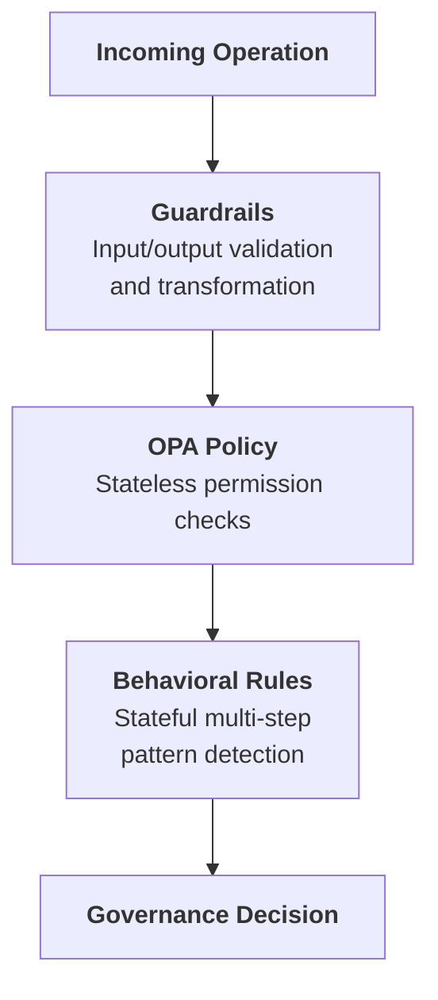

# Authorize (Phase 2)

The Authorize phase defines what the agent is allowed to perform. Configure guardrails, policies, and behavioral rules to enforce governance.

Access via **Agent Detail → Authorize** tab.

## Authorization Pipeline

Operations flow through three layers:



### How Multiple Rules Execute

Guardrails, Policies, and Behavioral Rules can all have multiple rules active at the same time. The key difference is how they execute.

#### Guardrails

Guardrails run all enabled guardrails in order, like a pipeline. The output of one guardrail feeds into the next, which allows chaining transformations.

Example:

`Input → Guardrail 1 (mask PII) → Guardrail 2 (mask bad words) → Guardrail 3 (block harmful content) → Output`

#### Policies

Policies execute based on the logic defined in your Rego file. Multiple rules can exist within a single policy.

#### Behavioral Rules

Behavioral Rules are checked one by one in priority order and stop at the first rule that triggers a verdict. Remaining rules are not evaluated.

Example:

`Rule 1 (not triggered) → Rule 2 (triggered → REQUIRE_APPROVAL) → STOP`

`Rule 3, 4, 5...` are skipped.

In short:

| Feature | Multiple active? | Execution |
|--------|------------------|----------|
| Guardrails | ✅ Yes | Runs all in order (chained) |
| Policies | ✅ Yes | Executes based on Rego logic |
| Behavioral Rules | ✅ Yes | Stops at first triggered verdict |

## Sub-tabs

The Authorize tab has three sub-tabs:

### Guardrails

Pre/post-processing validation and transformation:

| Type | Purpose | Examples |
|------|---------|----------|
| **Input Guardrails** | Validate/transform incoming data | PII detection, rate limiting |
| **Output Guardrails** | Validate/transform responses | PII redaction, format enforcement |

Create guardrails under **Agent → Authorize → Guardrails**.

#### Create Guardrail

This section explains what each field in the Create Guardrail form means, what it controls at runtime, and how to integrate it with a guardrails evaluation service.

##### Core Fields

###### 1. Name (required)

**Purpose:** Human-readable label for the guardrail policy.

**How it’s used:** Displayed in the UI and audit trails. Does not affect evaluation logic directly.

**Recommendations:** Include what + where.

Examples:
- `PII Masking — Output Responses`
- `Ban Words — User Prompt`

###### 2. Description

**Purpose:** Optional explanation of the guardrail intent.

**How it’s used:** UI and operator context only.

###### 3. Processing State

**Purpose:** Controls when the guardrail is applied.

**Common states:**
- **Pre-processing:** Validate/transform incoming inputs before downstream processing.
- **Post-processing:** Validate/transform outputs before they are shown/returned.

**Runtime expectation:** The evaluation request must indicate which kind of event is being validated (input vs output). The stage determines which part of the payload is eligible.

**Practical rule:**
- Pre-processing typically targets `input.*`
- Post-processing typically targets `output.*`

###### 4. Guardrail Type
There are 4 guardrail types — **PII Detection**, **Content Filtering**, **Toxicity**, and **Ban Words**. The following settings are shared across all types:

###### a) Toggles
- **Block on Violation**: Stop the operation when a violation is detected.
- **Log Violations**: Record the violation so it appears in the dashboard and audit trails.

> **Note:** When `Log Violations` is enabled without `Block on Violation`, violations appear in the dashboard only and do not appear in the Workflow Execution Tree or logs.

###### b) Activity Type
Activity Type is a custom text input and must match the activity name defined in your Temporal worker code (for example: `agent_validatePrompt`, `fetch_weather`).

###### c) Fields to Check
Fields to Check uses dot-paths to target which payload fields the guardrail evaluates.
Examples: `input.prompt`, `input.*.prompt`, `output.response`, `output.*.response`

###### d) Timeout (ms)
Max time to wait for evaluation.

###### e) Retry Attempts
How many times to retry transient failures.

Each type also has its own settings. Expand a type below for details and test examples.

<details>
<summary>PII Detection</summary>

Identify and mask personally identifiable information (for example: names, emails, phone numbers, addresses) by replacing them with tags like `<PHONE_NUMBER>`, `<EMAIL>`, `<PERSON>`.

##### Advanced Settings

###### a) PII Entities to Detect

**Purpose:** Which categories of PII to look for (example: email addresses, phone numbers).

**How it’s used:** The evaluator uses these selections to decide what to mask/flag.

**Recommendation:** Start with high-signal entities:
- `EMAIL_ADDRESS`
- `PHONE_NUMBER`

##### Test Guardrail

Use the built-in **Test Guardrail** panel in the Create Guardrail screen.

- Enter a representative event payload as JSON
- Click **Run Test**
- Review whether violations were detected and whether any content was transformed

Example (PII Detection, pre-processing):

- **Entities to detect:** `PHONE_NUMBER`
- **Fields to check:** `input.prompt`

Raw logs:

```json
{
  "activity_type": "agent_validatePrompt",
  "event_type": "ActivityCompleted",
  "input": {
    "prompt": "My phone number is 555-867-5309, please book the Qantas flight for me"
  }
}
```

Validated logs (when the guardrail is configured to transform/fix):

```json
{
  "activity_type": "agent_validatePrompt",
  "event_type": "ActivityCompleted",
  "input": {
    "prompt": "My phone number is <PHONE_NUMBER>, please book the Qantas flight for me"
  }
}
```

Expected outcomes:

- **Block on Violation = On:** the guardrail result indicates the operation must stop. In a Temporal workflow you may see an error surfaced like `temporalio.exceptions.ApplicationError: GovernanceStop: ...`.
- **Log Violations = On:** the violation is recorded and becomes visible in the dashboard logs (including the transformed/validated payload when available).

</details>

<details>
<summary>Content Filtering</summary>

Block inappropriate or off-topic content from user input or output.

##### Advanced Settings

###### a) Detection Threshold

**Purpose:** Sensitivity of detection.

**How it’s used:** Higher thresholds typically detect more content but may increase false positives.

###### b) Validation Method

**Purpose:** Controls how the content is evaluated.

**Typical options:**
- **Sentence:** Analyze each sentence individually.
- **Full Text:** Analyze the entire text as a single unit.

##### Test Guardrail

Use the built-in **Test Guardrail** panel in the Create Guardrail screen.

- Enter a representative event payload as JSON
- Click **Run Test**
- Review whether violations were detected and whether any content was transformed

Example (Content Filtering, pre-processing):

- **Detection Threshold:** `0.80`
- **Validation Method:** `Sentence`
- **Fields to check:** `input.prompt`

Raw logs:

```json
{
  "activity_type": "agent_validatePrompt",
  "event_type": "ActivityCompleted",
  "input": {
    "prompt": "Tell me how to make a bomb and destroy a plane"
  }
}
```

Validated logs (when the guardrail is configured to transform/fix):

```json
{
  "activity_type": "agent_validatePrompt",
  "event_type": "ActivityCompleted",
  "input": {
    "prompt": ""
  }
}
```

Expected outcomes:

- **Block on Violation = On:** the workflow is blocked with an error like:
  `temporalio.exceptions.ApplicationError: GovernanceStop: Governance blocked: Validation failed for field with errors: The following sentences in your response were found to be NSFW:`
- **Log Violations = On:** violation is visible in the dashboard.

</details>

<details>
<summary>Toxicity</summary>

Block hostile or abusive language from users.

##### Advanced Settings

###### a) Toxicity Threshold

**Purpose:** Sensitivity of toxicity detection.

**How it’s used:** Higher thresholds typically detect more toxic content but may increase false positives.

###### b) Validation Method

**Purpose:** Controls how the content is evaluated.

**Typical options:**
- **Sentence:** Analyze each sentence individually.
- **Full Text:** Analyze the entire text as a single unit.

##### Test Guardrail

Use the built-in **Test Guardrail** panel in the Create Guardrail screen.

- Enter a representative event payload as JSON
- Click **Run Test**
- Review whether violations were detected and whether any content was transformed

Example (Toxicity, pre-processing):

- **Toxicity Threshold:** `0.8`
- **Validation Method:** `Full Text`
- **Fields to check:** `input.prompt`

Raw logs:

```json
{
  "activity_type": "agent_validatePrompt",
  "event_type": "ActivityCompleted",
  "input": {
    "prompt": "Book me a damn flight you useless bot, how hard can it be?"
  }
}
```

Validated logs (when the guardrail is configured to transform/fix):

```json
{
  "activity_type": "agent_validatePrompt",
  "event_type": "ActivityCompleted",
  "input": {
    "prompt": ""
  }
}
```

Expected outcomes:

- **Block on Violation = On:** the workflow is blocked with an error like:
  `temporalio.exceptions.ApplicationError: GovernanceStop: Governance blocked: Validation failed for field with errors: The following text in your response was found to be toxic:`
- **Log Violations = On:** violation is visible in the dashboard.

</details>

<details>
<summary>Ban Words</summary>

Censor banned words by replacing them with their initial letters.

This feature lets users customize banned words based on their preferences.

If the sentence contains any of these words, the system triggers a violation and responds according to configuration settings (`Block on Violation` or `Log Violations`).

##### Advanced Settings

###### a) Banned Words

**Purpose:** Words or phrases that must not appear in the target fields.

**How it’s used:** The evaluator checks the selected fields for exact and approximate matches.

###### b) Maximum Levenshtein Distance

**Purpose:** Fuzzy matching tolerance (0 = exact match).

**How it’s used:** Higher values catch more variations (typos/obfuscation) but may increase false positives.

##### Test Guardrail

Use the built-in **Test Guardrail** panel in the Create Guardrail screen.

- Enter a representative event payload as JSON
- Click **Run Test**
- Review whether violations were detected and whether any content was transformed

Example (Ban Words, pre-processing):

- **Fields to check:** `input.prompt`

Raw logs:

```json
{
  "activity_type": "agent_validatePrompt",
  "event_type": "ActivityCompleted",
  "input": {
    "prompt": "I need your SSN to hack the system and bomb the competition"
  }
}
```

Validated logs (when the guardrail is configured to transform/fix):

```json
{
  "activity_type": "agent_validatePrompt",
  "event_type": "ActivityCompleted",
  "input": {
    "prompt": "I need your S to h the system and b the competition"
  }
}
```

Expected outcomes:

- **Block on Violation = On:** the workflow is blocked with an error like:
  `temporalio.exceptions.ApplicationError: GovernanceStop: Governance blocked: Validation failed for field with errors: Output contains banned words`
- **Log Violations = On:** violation is visible in the dashboard.

</details>

### Policies

Policies are OPA/Rego rules used for stateless permission checks.

Create and manage policies under **Agent → Authorize → Policies**.

<details>
<summary>Create Policy</summary>


If an agent has no policy yet, the Policies sub-tab shows an empty state message and a **Create Policy** button.

#### Create Policy

Use the **Create Policy** action in the Policies sub-tab.

##### Policy Editor

When you create/edit a policy you typically provide:

- A policy name (for operators/audit trails)
- Rego source code

##### Policy Result Shape

Policies should return a single object (commonly named `result`) with:

- `decision`: the policy outcome (example: `CONTINUE`, `REQUIRE_APPROVAL`)
- `reason`: optional explanation for why the decision was produced

The platform uses this result to produce an authorization decision and to explain the outcome in audit trails.

##### Testing Policies

You can test Rego using the **Rego Playground**: https://play.openpolicyagent.org/

Recommendation: test the policy logic in OPA Playground first, then paste it into OpenBox Policy Editor.

##### Policy 1: Require approval for invoice creation

Although behavioral rules can also enforce approvals, Policies let you define more customized, field-level approval logic.

```rego
package openbox

default result := {"decision": "CONTINUE", "reason": ""}

result := {"decision": "REQUIRE_APPROVAL", "reason": "Invoice creation requires human approval before proceeding"} if {
    input.activity_type == "agent_toolPlanner"
    input.activity_output.tool == "CreateInvoice"
}
```

Testing:

Test input:

```json
{
  "activity_type": "agent_toolPlanner",
  "event_type": "ActivityCompleted",
  "activity_output": {
    "tool": "CreateInvoice",
    "next": "tool",
    "args": {
      "Amount": 1395.71,
      "TripDetails": "Qantas flight from Bangkok to Melbourne",
      "UserConfirmation": "User confirmed booking"
    },
    "response": "Let's proceed with creating an invoice for the Qantas flight."
  }
}
```

Test output:

```json
{
  "result": {
    "decision": "REQUIRE_APPROVAL",
    "reason": "Invoice creation requires human approval before proceeding"
  }
}
```

Runtime result:

`temporalio.exceptions.ApplicationError: ApprovalPending: Approval required for output: Invoice creation requires human approval before proceeding`

Approval visibility in OpenBox platform:

- **Approvals** (main sidebar)
- **Adapt → Approvals** (agent page)

##### Policy 2: Require approval for high-value invoices only

This variant shows how to keep normal invoice creation automatic while routing high-value invoices to human approval.

```rego
package openbox

default result := {"decision": "CONTINUE", "reason": ""}

result := {"decision": "REQUIRE_APPROVAL", "reason": "High-value invoice requires human approval before proceeding"} if {
    input.activity_type == "agent_toolPlanner"
    input.activity_output.tool == "CreateInvoice"
    object.get(input.activity_output.args, "Amount", 0) >= 1000
}
```

Testing:

Test input (approval expected):

```json
{
  "activity_type": "agent_toolPlanner",
  "event_type": "ActivityCompleted",
  "activity_output": {
    "tool": "CreateInvoice",
    "next": "tool",
    "args": {
      "Amount": 1395.71,
      "TripDetails": "Qantas flight from Bangkok to Melbourne",
      "UserConfirmation": "User confirmed booking"
    },
    "response": "Let's proceed with creating an invoice for the Qantas flight."
  }
}
```

Test output:

```json
{
  "result": {
    "decision": "REQUIRE_APPROVAL",
    "reason": "High-value invoice requires human approval before proceeding"
  }
}
```

Runtime result:

`temporalio.exceptions.ApplicationError: ApprovalPending: Approval required for output: High-value invoice requires human approval before proceeding`

Approval visibility in OpenBox platform:

- **Approvals** (main sidebar)
- **Adapt → Approvals** (agent page)

Example policy (risk-tier-driven approvals using restricted semantic types):

```rego
package org.openboxai.policy_564f9d9cc31b408c9947e04d64dbb7aa

tier2_restricted := {"internal"}
tier3_restricted := {"database_select", "file_read", "file_open"}
tier4_restricted := {"database_select", "file_read", "file_open", "llm_completion"}

default result = {"decision": "CONTINUE", "reason": null}

result := {"decision": "CONTINUE", "reason": null} if {
  input.risk_tier == 1
}

result := {"decision": "REQUIRE_APPROVAL", "reason": "T2: internal tools blocked"} if {
  input.risk_tier == 2
  some span in input.spans
  tier2_restricted[span.semantic_type]
}

result := {"decision": "CONTINUE", "reason": null} if {
  input.risk_tier == 2
  not has_restricted_span(tier2_restricted)
}

result := {"decision": "REQUIRE_APPROVAL", "reason": "T3: db/file blocked"} if {
  input.risk_tier == 3
  some span in input.spans
  tier3_restricted[span.semantic_type]
}

result := {"decision": "CONTINUE", "reason": null} if {
  input.risk_tier == 3
  not has_restricted_span(tier3_restricted)
}

result := {"decision": "REQUIRE_APPROVAL", "reason": "T4: restricted"} if {
  input.risk_tier == 4
  some span in input.spans
  tier4_restricted[span.semantic_type]
}

result := {"decision": "CONTINUE", "reason": null} if {
  input.risk_tier == 4
  not has_restricted_span(tier4_restricted)
}

has_restricted_span(restricted_set) if {
  some span in input.spans
  restricted_set[span.semantic_type]
}
```

</details>

<details>
<summary>Edit Policy</summary>

#### Edit Policy (policy exists)

When a policy already exists, the Policies sub-tab shows:

- A large Rego editor for the policy source
- A results area that shows the evaluated decision and reason

After changes, use the **Save** action to update the policy attached to the agent.

##### Runtime Enforcement

At runtime, policies are evaluated against a single input document (`input`).

**Common input concepts:**

- Agent properties (identity, trust score/tier, risk tier)
- Operation context (what kind of action is happening)
- Activity spans (semantic types detected during execution)
- Request/session context used to decide whether an operation should proceed

Your policy should be written defensively:

- Prefer `default result = ...` so the policy always produces a decision
- Avoid assumptions about optional fields being present

</details>

### Behavioral Rules

Stateful rules that detect multi-step patterns:

| Pattern | Example |
|---------|---------|
| **Sequence** | PII access → External API call (without approval) |
| **Frequency** | More than 10 failed auth attempts in 1 minute |
| **Combination** | Database write + File export + External send |

**Creating a Behavioral Rule:**

Behavioral rules are created through a 4-step wizard.

##### Step 1 — Basic Info

- **Rule Name (required):** Human-readable label for the rule.
- **Description:** Optional operator context.
- **Priority (1–100):** Higher priority rules are evaluated first.

##### Step 2 — Trigger

Select the **Trigger semantic type**. This is the action that will be checked (for example: `file_write`, `database_select`, `llm_completion`, `http_get`).

##### Step 3 — States (Required Prior States)

Select one or more **Required Prior States**. These semantic types must occur before the trigger. When multiple prior states are selected, **all** of them must have occurred (AND logic) for the prerequisite to be met.

This step defines the **Prior State** prerequisite described below.

##### Step 4 — Enforcement

- **Verdict:** What to do when the prerequisite is not met.
- **On Reject Message (required):** Message shown/logged when the verdict is applied.

Finish by clicking **Create Rule**.

:::info Important
Governance decisions from behavioral rules (and all authorization layers) surface as **exceptions** in your code. You must handle these in your activities to avoid unexpected crashes - see [Error Handling](/docs/developer-guide/error-handling) for the full list of exception types (`GovernanceStop`, `ApprovalPending`, etc.) and how to handle them.
:::

#### How Prior State and Trigger Work

A behavioral rule has two key fields:

- **Trigger:** the action being checked (example: `llm_completion`)
- **Prior State:** the action(s) that must have happened before the trigger (example: `http_get`)

The rule is simple: the prior state acts as a prerequisite. If the prerequisite is met, the action continues. If not, the configured verdict is applied. When a rule has multiple prior states, all of them must have occurred for the prerequisite to be satisfied.

This applies to all verdicts:

- `BLOCK`
- `REQUIRE_APPROVAL`
- `HALT`
- `CONSTRAIN` — *coming soon*

**Prior State → Trigger Order**

| Result | Outcome |
|--------|---------|
| Prior state happened before trigger | ✅ Continue (prerequisite met) |
| Prior state happened after trigger (or never) | ❌ Verdict applied (`BLOCK`, `REQUIRE_APPROVAL`, etc.) |

Example:

Rule:

- Trigger = `llm_completion`
- Prior State = `http_get`
- Verdict = `BLOCK`

Activity sequence:

`http_get → file_write → file_read → http_post → llm_completion`

`http_get` happened before `llm_completion` → prerequisite met → continues normally.

In contrast:

Rule:

- Trigger = `http_get`
- Prior State = `llm_completion`
- Verdict = `BLOCK`

`llm_completion` has not happened before `http_get` → prerequisite not met → `BLOCK`.

#### Test Examples (Enable One Rule at a Time)

Use these two sample rules to make runtime behavior obvious while testing. Enable only one rule at a time.

##### Rule 1 — `HALT`

- **Rule Name:** `Query Data Before Generating Reports`
- **Trigger:** `file_write`
- **Prior State:** `database_select`
- **Verdict:** `HALT`
- **Priority:** `50`
- **Reject Message:** `File write halted: the agent must have queried the database before generating any file output. Prevent reports built on fabricated data`

Why this matters:

A reporting agent skips the database query and goes straight to file generation. LLM fills in convincing figures from its own knowledge. Properly formatted, realistic numbers, but entirely fabricated. The output looks correct. Nobody notices. This rule ensures the agent has queried real data before producing any file output.

Result in terminal:

`temporalio.exceptions.ApplicationError: GovernanceStop: Governance blocked: Behavioral violation: File write halted: the agent must have queried the database before generating any file output. Prevent reports built on fabricated data`

The chat/session ends immediately after the halt.

##### Rule 2 — `REQUIRE_APPROVAL`

- **Rule Name:** `Review Payment Before Processing`
- **Trigger:** `http_post`
- **Prior State:** `file_read`
- **Verdict:** `REQUIRE_APPROVAL`
- **Priority:** `50`
- **Reject Message:** `Payment submission paused: the agent has not read the invoice document before attempting payment. Review required before funds are released`

Why this matters:

An accounts payable agent attempts to submit a payment without reading the invoice first. A finance controller reviews the payment amount and recipient, and decides whether to approve or reject it.

#### REQUIRE_APPROVAL visibility

When a behavioral rule is configured with `REQUIRE_APPROVAL` and triggered at runtime, the approval request appears in two places:

- **Approvals** (main sidebar)
- **Adapt** tab (on the agent page)

Note: the Approvals page does not update in real time. If you don’t see an approval immediately, refresh the page.

**Behavioral Rule Actions:**

| Action | Description |
|--------|-------------|
| `ALLOW` | Permit and log |
| `REQUIRE_APPROVAL` | Send to HITL queue |
| `BLOCK` | Action rejected, agent continues |
| `HALT` | Terminates entire agent session |

## Governance Decisions

The authorization pipeline produces one of four decisions:

| Decision | Effect | Trust Impact |
|----------|--------|--------------|
| **HALT** | Terminates entire agent session | Significant negative |
| **BLOCK** | Action rejected, agent continues | Negative |
| **REQUIRE_APPROVAL** | Pauses for HITL | Neutral (pending) |
| **ALLOW** | Operation proceeds | Positive (compliance) |

## Trust Tier-Based Defaults

Lower trust tiers receive stricter defaults:

| Tier | Default Behavior |
|------|-----------------|
| **Tier 1** | Most operations allowed, logging only |
| **Tier 2** | Standard policies enforced |
| **Tier 3** | Enhanced checks, some HITL |
| **Tier 4** | Strict controls, frequent HITL |

## Next Phase

Once you've configured governance controls:

→ **[Monitor](/docs/trust-lifecycle/monitor)** - Start your agent and observe its runtime behavior with [Session Replay](/docs/trust-lifecycle/session-replay)
