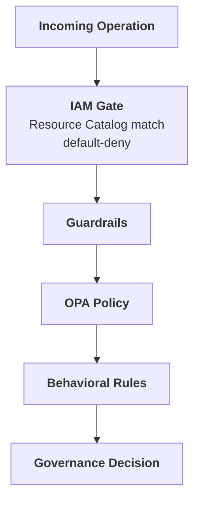

# Agent IAM Gate

:::tip 🆕 New page in this review
Everything on this page is new.
:::

The IAM gate is a default-deny access check that runs before the three Authorize layers. You declare business resources (an API, a database, a queue) in the [Resource Catalog](/dashboard/resource-catalog); the gate matches each governed operation against the catalog and denies anything unmatched, independent of whether a guardrail, policy, or behavioral rule would otherwise allow it.

Configure resources under **Organization → Resource Catalog**. Assign agent roles on each resource from the same page.

## Where It Runs

The IAM gate runs first in the authorization pipeline, ahead of guardrails:

If an operation's target doesn't match a declared resource, or the agent holds no role on the resource it matches, the gate denies the operation immediately: guardrails, policies, and behavioral rules never run, once the gate is enforcing for that agent (see [Rollout](#rollout-monitor-then-enforce) below).

The gate is org-wide and always in front of Guardrails, Policies, and Behavioral Rules: every governed operation passes through it first, and unlike those layers, it isn't something you choose to route a use case through. What is configurable is each agent's own rollout stage on the gate.

## Rollout: Monitor Then Enforce

Each agent starts on the gate in **Monitor** mode: operations are evaluated against the Resource Catalog exactly as described above, and anything that would be denied is logged (see [Implicit Deny](#implicit-deny)), but nothing is actually blocked yet. This lets you confirm an agent's granted roles cover its real traffic before enforcement has teeth.

Once you're confident in that coverage, switch the agent to **Enforce**. From that point, the same evaluation actually denies unmatched or unauthorized operations instead of only logging them. Not every agent enforces from day one; an agent can sit in Monitor for as long as needed before you flip it to Enforce.

## Resource Catalog

A **resource** is a business-level thing your agents interact with (an internal API, a database, a message queue). Each resource declared in the catalog has a name, a type, a match pattern that identifies which operations belong to it, an owning team, and a status.

See **[Resource Catalog](/dashboard/resource-catalog)** for the full field reference and how to create one.

## Agent Roles

Resources grant access by role; an agent isn't allowed against a resource just because it's registered in your org. The role determines what the agent can do once matched:

| Role | Grants |
|------|--------|
| **Reader** | Read-only operations against the resource |
| **Operator** | Read and write operations against the resource |
| **Owner** | Full access, plus the ability to grant roles to other agents on this resource |

An agent with no role granted on a resource is denied when it matches that resource. Grant roles from the resource's detail view in the [Resource Catalog](/dashboard/resource-catalog#grant-agent-roles).

Resource roles are a separate concept from an agent's own identity attributes: every agent also has a required human owner (the person accountable for it) and a lifecycle state (for example, active or suspended; see [Suspending Agent Access](#suspending-agent-access) below). A role grant says what an agent can do once matched to a resource; it doesn't by itself make the agent accountable to a person or determine whether the agent is allowed to operate at all.

## Implicit Deny

Any operation that doesn't match a declared resource, or matches one where the agent holds no role, is logged with the reason code `UNMATCHED_IMPLICIT_DENY`. Once the agent is in **Enforce** mode this also denies the operation; while the agent is still in **Monitor** mode (see [Rollout](#rollout-monitor-then-enforce)), it's recorded but not blocked. Either way, "nothing declared" is an auditable, explicit outcome instead of a silent pass-through.

## Suspending Agent Access

Suspending an agent's IAM access is the same action as **Pause** in [Agent Settings → Danger Zone](/dashboard/agents/agent-settings#danger-zone); while paused, every resource match is denied regardless of granted roles, and normal access resumes as soon as the agent is unpaused.

## Related

- **[Resource Catalog](/dashboard/resource-catalog)**: Declare and manage resources
- **[Authorize Phase](/trust-lifecycle/authorize)**: See where the IAM gate fits in the full pipeline
- **[Agent Settings](/dashboard/agents/agent-settings#danger-zone)**: Pause or revoke an agent
