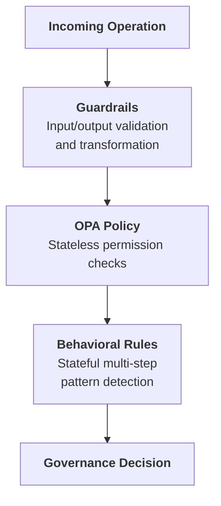

# Authorize (Phase 2)

The Authorize phase defines what the agent is allowed to perform. Configure guardrails, policies, and behavioral rules to enforce governance.

Access via **Agent Detail → Authorize** tab.

## Authorization Pipeline

Operations flow through three layers:

### How Multiple Rules Execute

Guardrails, Policies, and Behavioral Rules can all have multiple rules active at the same time. The key difference is how they execute.

**[Guardrails](./guardrails)** run all enabled guardrails in order, like a pipeline. The output of one guardrail feeds into the next, which allows chaining transformations.

`Input → Guardrail 1 (mask PII) → Guardrail 2 (mask bad words) → Guardrail 3 (block harmful content) → Output`

**[Policies](./policies)** execute based on the logic defined in your Rego file. Multiple rules can exist within a single policy.

**[Behavioral Rules](./behaviours)** are checked one by one in priority order and stop at the first rule that triggers a verdict. Remaining rules are not evaluated.

`Rule 1 (not triggered) → Rule 2 (triggered → REQUIRE_APPROVAL) → STOP` — Rule 3, 4, 5... are skipped.

| Feature | Multiple active? | Execution |
|--------|------------------|----------|
| [Guardrails](./guardrails) | Yes | Runs all in order (chained) |
| [Policies](./policies) | Yes | Executes based on Rego logic |
| [Behavioral Rules](./behaviours) | Yes | Stops at first triggered verdict |

## Governance Decisions

The authorization pipeline produces one of four decisions:

| Decision | Effect | Trust Impact |
|----------|--------|--------------|
| **HALT** | Terminates entire agent session | Significant negative |
| **BLOCK** | Action rejected, agent continues | Negative |
| **REQUIRE_APPROVAL** | Pauses for HITL | Neutral (pending) |
| **ALLOW** | Operation proceeds | Positive (compliance) |

## Trust Tier-Based Defaults

Lower trust tiers receive stricter defaults:

| Tier | Default Behavior |
|------|-----------------|
| **Tier 1** | Most operations allowed, logging only |
| **Tier 2** | Standard policies enforced |
| **Tier 3** | Enhanced checks, some HITL |
| **Tier 4** | Strict controls, frequent HITL |

## Next Phase

Once you've configured governance controls:

→ **[Monitor](/docs/trust-lifecycle/monitor)** — Start your agent and observe its runtime behavior with [Session Replay](/docs/trust-lifecycle/session-replay)
