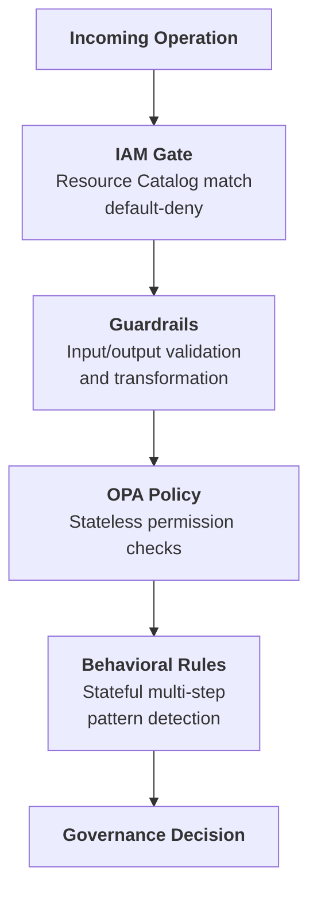

# Authorize (Phase 2)

The Authorize phase defines what the agent is allowed to perform. Configure guardrails, policies, and behavioral rules to enforce governance.

Access via **Agent Detail → Authorize** tab.

## Authorization Pipeline

<mark className="diff-mark">Before any of the three configurable layers run, the [Agent IAM Gate](./agent-iam-gate) checks the operation's target against the Resource Catalog and denies anything unmatched. Operations that pass the gate then flow through three layers:</mark>

```mermaid
flowchart TD
    incoming["<b>Incoming Operation</b>"]
    iam["<b>IAM Gate</b><br/>Resource Catalog match<br/>default-deny"]
    guardrails["<b>Guardrails</b><br/>Input/output validation<br/>and transformation"]
    opa["<b>OPA Policy</b><br/>Stateless permission checks"]
    behavioral["<b>Behavioral Rules</b><br/>Stateful multi-step<br/>pattern detection"]
    decision["<b>Governance Decision</b>"]

    incoming --> iam --> guardrails --> opa --> behavioral --> decision
```

<mark className="diff-mark">The IAM gate is org-wide and always evaluated; unlike the three layers below, it isn't something you configure per use case.</mark>

### Choosing the Right Layer

Each layer solves a different class of problem. Use the table below to decide which layer fits your use case.

| Layer | Reach for this when… | Example |
|-------|----------------------|---------|
| **Guardrails** | You need to validate or transform data flowing in/out: content safety, PII, banned terms | Mask credit-card numbers before they reach the LLM |
| **Policies** | You need a stateless permission check on a single operation: field-level conditions, thresholds, role gates | Block invoice creation above $1,000 without approval |
| **Behavioral Rules** | You need to detect multi-step patterns across a session (sequences, frequencies, combinations) or continuously score goal alignment against the original request | Halt file generation if the agent never queried the database |

### How Multiple Rules Execute

Guardrails, Policies, and Behavioral Rules can all have multiple rules active at the same time. The key difference is how they execute.

**[Guardrails](./guardrails)** run all enabled guardrails in order, like a pipeline. The output of one guardrail feeds into the next, which allows chaining transformations.

`Input → Guardrail 1 (mask PII) → Guardrail 2 (mask bad words) → Guardrail 3 (block harmful content) → Output`

**[Policies](./policies)** execute based on the logic defined in your Rego file. Multiple rules can exist within a single policy.

**[Behavioral Rules](./behaviors)** are checked one by one in priority order and stop at the first rule that triggers a verdict. Remaining rules are not evaluated.

`Rule 1 (not triggered) → Rule 2 (triggered → REQUIRE_APPROVAL) → STOP`. Rule 3, 4, 5... are skipped.

| Feature | Multiple active? | Execution |
|--------|------------------|----------|
| [Guardrails](./guardrails) | Yes | Runs all in order (chained) |
| [Policies](./policies) | Yes | Executes based on Rego logic |
| [Behavioral Rules](./behaviors) | Yes | Stops at first triggered verdict |

## Governance Decisions

The authorization pipeline produces one of <mark className="diff-mark">five</mark> decisions:

| Decision | Effect | Trust Impact |
|----------|--------|--------------|
| **HALT** | Terminates entire agent session | Significant negative |
| **BLOCK** | Action rejected, agent continues | Negative |
| **REQUIRE_APPROVAL** | Pauses for HITL | Neutral (pending) |
| <mark className="diff-mark">**CONSTRAIN**</mark> | <mark className="diff-mark">Operation proceeds under recorded constraints</mark> | <mark className="diff-mark">Neutral (constrained)</mark> |
| **ALLOW** | Operation proceeds | Positive (compliance) |

<mark className="diff-mark">See **[Governance Decisions](/core-concepts/governance-decisions)** for the full definition of each, including precedence order.</mark>

## <mark className="diff-mark">Fail-Safe By Design</mark>

<mark className="diff-mark">Each layer behaves differently when the service backing it is unreachable:</mark>

| Layer | On outage |
|-------|-----------|
| <mark className="diff-mark">**Policy evaluation (OPA)**</mark> | <mark className="diff-mark">Fails closed: operations are blocked until the policy service is reachable again</mark> |
| <mark className="diff-mark">**Guardrail evaluation**</mark> | <mark className="diff-mark">Hard fails: the operation errors rather than proceeding unvalidated</mark> |
| <mark className="diff-mark">**Behavioral-analytics evaluation**</mark> | <mark className="diff-mark">Fails open with a circuit breaker: operations proceed without that check, and the SDK stops calling the unreachable service until it recovers</mark> |

<mark className="diff-mark">Every response flags whether a fallback path was used, so a period of degraded evaluation is visible in the event log rather than indistinguishable from normal enforcement.</mark>

## Trust Tier-Based Defaults

Lower trust tiers receive stricter defaults:

| Tier | Default Behavior |
|------|-----------------|
| **Tier 1** | Most operations allowed, logging only |
| **Tier 2** | Standard policies enforced |
| **Tier 3** | Enhanced checks, some HITL |
| **Tier 4** | Strict controls, frequent HITL |

## Next Phase

Once you've configured governance controls:

→ **[Monitor](/trust-lifecycle/monitor)**: Start your agent and observe its runtime behavior with [Session Replay](/trust-lifecycle/session-replay)
