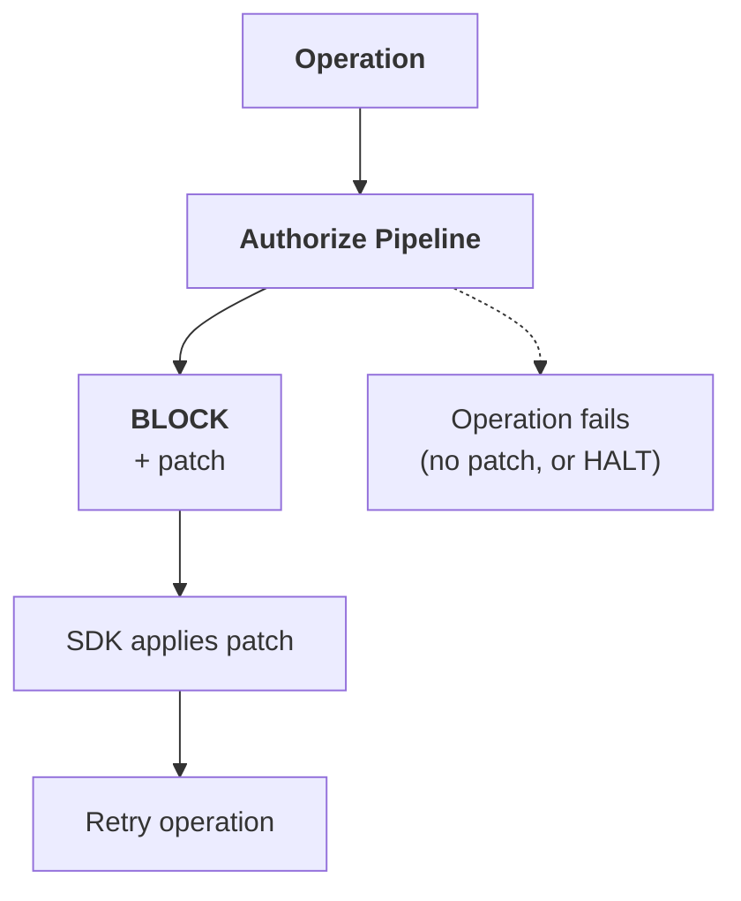

# Patch & Retry

:::tip 🆕 New page in this review
Everything on this page is new.
:::

A [BLOCK](/core-concepts/governance-decisions#block) verdict can carry a **patch**: a machine-readable fix for the specific problem that caused the block. When a patch is present, the SDK applies it to the operation and retries automatically, instead of simply failing.

## How It Works

1. The authorization pipeline evaluates an operation and returns `BLOCK` with a `patch` payload.
2. The SDK applies the patch to the operation's input or parameters.
3. The SDK retries the operation once with the patched input.
4. If the retried operation clears evaluation, it proceeds. If it's blocked again, the SDK surfaces the failure; it does not retry indefinitely.

A BLOCK verdict without a patch behaves exactly as documented in [Governance Decisions → BLOCK](/core-concepts/governance-decisions#block): the operation fails and the SDK does not retry.

## HALT Always Wins

A patch only ever rides on `BLOCK`. If a HALT is returned (at any point, including on the retried operation), the patch is discarded and the session terminates per [Governance Decisions → HALT](/core-concepts/governance-decisions#halt). Patch & Retry never overrides session termination.

## Patch Shape

A patch describes a targeted correction to the specific field or parameter that caused the block, not a full replacement of the operation:

| Field | Description |
|-------|--------------|
| **target** | The input field or parameter the patch applies to |
| **operation** | How to apply the patch, for example `replace` or `redact` |
| **value** | The corrected value to apply |
| **reason** | Human-readable explanation logged alongside the retry |

## Where Patches Come From

Patches are produced by whichever layer issued the BLOCK:

- A **guardrail** that can transform the offending content (for example, masking a detected secret) attaches a patch instead of a bare block
- A **policy** can return a patch alongside a `deny` result when the violation has a well-defined fix
- **Behavioral rules** typically block without a patch, since the violation is usually about sequence or timing rather than a single correctable field

## What Gets Logged

Every patched retry is logged as two linked events: the original `BLOCK` with its patch, and the retried operation's outcome. Both appear in [Session Replay](/trust-lifecycle/session-replay) so the original violation and the correction are visible together.

## Related

- **[Governance Decisions](/core-concepts/governance-decisions)**: Full verdict reference, including BLOCK and HALT
- **[Cognitive Debugger](/trust-lifecycle/cognitive-debugger)**: Forensics and remediation for sessions that didn't recover automatically
- **[Guardrails](/trust-lifecycle/authorize/guardrails)**: A common source of patched blocks
