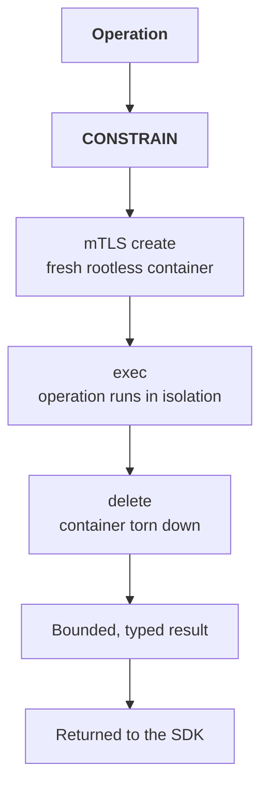

# Sandbox Execution

:::tip 🆕 New page in this review
Everything on this page is new.
:::

:::info Alpha
Sandbox Execution is in Alpha. Configuration is SDK/environment-based today; there is no dashboard toggle for it yet.
:::

A [CONSTRAIN](/core-concepts/governance-decisions#constrain) verdict can hand the constrained operation to the **Sandbox** (a rootless container that you own and run, reached over mTLS) instead of executing it in-process. The Sandbox runs the operation under rootless container isolation and returns a bounded, typed result to the SDK.

## Why Isolation Instead Of A Bare Constraint

Most CONSTRAIN verdicts apply a transformation and let the operation continue where it already was (see [Governance Decisions → CONSTRAIN](/core-concepts/governance-decisions#constrain)). Sandbox Execution is for the subset of constrained operations where the safer response isn't "modify the input" but "run this somewhere isolated," for example, code execution, or an operation touching resources you don't want a lower-trust-tier operation reaching directly.

## How It Works

1. The authorization pipeline returns `CONSTRAIN` with a directive to sandbox the operation.
2. Over mTLS, the SDK has a fresh, rootless container **created** on your Sandbox infrastructure for this execution.
3. The SDK sends the operation into that container, which **exec**s it under rootless isolation and produces a bounded, typed result, not an arbitrary payload.
4. The container is **deleted** once the result is returned; nothing persists between executions, so every operation gets a fresh, one-shot container.
5. The SDK receives the bounded, typed result and the operation continues with it.

Each execution goes through this same three-step lifecycle (mTLS create → exec → delete) over a mutually authenticated connection; no container is reused across operations.

## Client-Owned, Not OpenBox-Hosted

The Sandbox container runs in infrastructure you own and operate. OpenBox does not execute your code; it directs eligible operations to your container over mTLS and governs the result the same way it governs any other operation output.

## Configuring It

Sandbox Execution is configured through SDK/environment settings on the agent's runtime, not through a dashboard form. Check your framework's Configuration guide (for example, [LangGraph Configuration](/developer-guide/langgraph/configuration)) for connection and mTLS settings as they become available for your integration.

:::note Open question
Whether Sandbox Execution gains a dashboard configuration surface (matching the "Create under Agent → Authorize" pattern used by Guardrails, Policies, and Behavioral Rules) hasn't been decided. This page will be updated if that changes.
:::

## Related

- **[Governance Decisions](/core-concepts/governance-decisions)**: The CONSTRAIN verdict this feature hangs off of
- **[Authorize Phase](/trust-lifecycle/authorize)**: Where CONSTRAIN fits in the full pipeline
