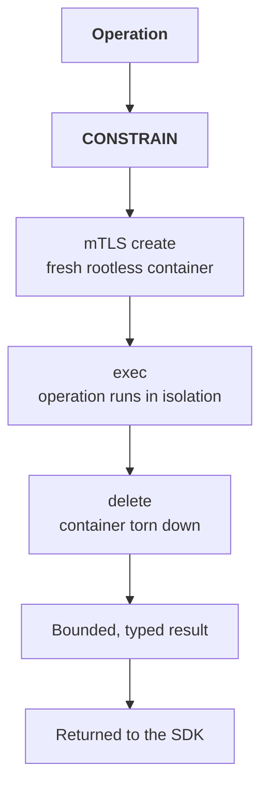

# Sandbox Execution

:::tip 🆕 New page in this review
Everything on this page is new.
:::

:::info Alpha
Sandbox Execution is in Alpha. Configuration is SDK/environment-based today; there is no dashboard toggle for it yet.
:::

For an operation type with a sandbox-capable integration, a [CONSTRAIN](/core-concepts/governance-decisions#constrain) verdict can route the operation to the **Sandbox** instead of executing it in-process. The client-owned, rootless container is reached over mTLS and returns a bounded, typed result. Integrations without an enforcement path must fail closed; they must not treat `CONSTRAIN` as `ALLOW`.

## Why Isolation Instead Of A Bare Constraint

`CONSTRAIN` describes a required enforcement outcome, not one universal execution mechanism. Some integrations enforce a transformed input or another bounded control. Sandbox Execution is for registered operation types whose constraint is isolation—for example, code execution or access to resources that a lower-trust-tier operation must not reach directly.

## How It Works

1. The authorization pipeline returns exact `CONSTRAIN` for a registered, sandbox-capable operation.
2. Over mTLS, the integration has a fresh, rootless container **created** on your Sandbox infrastructure.
3. The integration sends the admitted operation into that container, which **exec**s it under rootless isolation and produces a bounded, typed result, not an arbitrary payload.
4. The container is **deleted** after execution; nothing persists between executions, and cleanup remains explicit if deletion fails.
5. The integration returns only its bounded result contract to the caller.

Each execution goes through this same three-step lifecycle (mTLS create → exec → delete) over a mutually authenticated connection; no container is reused across operations.

## Client-Owned, Not OpenBox-Hosted

The Sandbox container runs in infrastructure you own and operate. OpenBox does not execute your code; it directs eligible operations to your container over mTLS and governs the result the same way it governs any other operation output.

## Configuring It

Sandbox Execution is configured through SDK and deployment settings on the agent's runtime, not through a dashboard form. Check the framework-specific guide for availability. Temporal Python supports the model for [registered governed commands](/developer-guide/temporal-python/governed-sandbox-commands); ordinary Temporal actions do not become sandbox-capable.

:::note Open question
Whether Sandbox Execution gains a dashboard configuration surface (matching the "Create under Agent → Authorize" pattern used by Guardrails, Policies, and Behavioral Rules) hasn't been decided. This page will be updated if that changes.
:::

## Related

- **[Governance Decisions](/core-concepts/governance-decisions)**: The CONSTRAIN verdict this feature hangs off of
- **[Authorize Phase](/trust-lifecycle/authorize)**: Where CONSTRAIN fits in the full pipeline
- **[Temporal governed commands](/developer-guide/temporal-python/governed-sandbox-commands)**: Temporal-specific registration, history, and zero-host requirements
