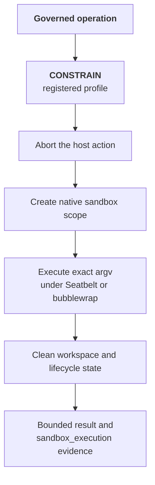

# Sandbox Execution

:::tip 🆕 New page in this review
Everything on this page is new.
:::

:::info Alpha
Sandbox Execution is in Alpha. Configuration is SDK- and environment-based today; there is no dashboard toggle for it yet.
:::

For an operation type with a sandbox-capable integration, a [CONSTRAIN](/core-concepts/governance-decisions#constrain) verdict can replace the host action with an admitted command in the **Sandbox**. The default `native` provider runs that command under the host operating system's native isolation boundary: Seatbelt (`sandbox-exec`) on macOS and bubblewrap on Linux.

The integration must fail closed if it cannot enforce the constraint. `CONSTRAIN` is never a logging-only form of `ALLOW`, and a failed sandbox dispatch never falls back to host execution.

## How It Works

1. A policy or behavioral rule returns `CONSTRAIN` for an operation that maps to a registered command profile.
2. The integration derives an immutable `argv` from that profile. Workflow input cannot supply arbitrary executable text or a shell command string.
3. The attempted host action is aborted before its side effect. The dispatcher makes at most one sandbox dispatch and never switches providers after a possible dispatch.
4. The native provider verifies the provisioned policy/profile hash, invokes the exact `argv` under `sandbox-exec` or bubblewrap, and bounds stdout, stderr, and execution time.
5. Cleanup remains explicit after success, failure, timeout, or cancellation. The integration returns a bounded result and emits a `sandbox_execution` span.

## Native Security Boundary

The native provider:

- compiles policy templates during provisioning, stores them owner-only, pins their SHA-256 digest in service configuration, and verifies that digest before execution;
- clears the command environment and supplies no caller-selected mounts, credentials, working directory, or environment variables;
- admits writes only in the sandbox workspace and invokes `argv` directly without shell reconstruction;
- uses a private network namespace for deny-network policies on Linux; and
- uses an execution-scoped HTTP(S) proxy for per-domain allowlists.

For a network-enabled policy, the proxy resolves DNS outside the sandbox and compares each normalized `host:port` with the provisioned endpoints. Denied hosts and IP-literal bypass attempts receive HTTP 403. On macOS, Seatbelt permits only the execution's ephemeral loopback proxy port, so direct sockets and a stopped proxy have no fallback egress path.

## Violation Monitoring

Terminal evidence records each observed proxy decision, including its allowed/denied disposition, host, and port. On macOS, the service also queries the unified log for Seatbelt violations associated with the exact sandbox process and records the violation count and stable denial categories.

Linux bubblewrap does not expose an equivalent unprivileged per-process denial stream, so Linux results omit OS violation records. Proxy decisions are still recorded for proxy-aware HTTP(S) clients.

## Client-Owned Boundary

The sandbox service and its mTLS credentials run in infrastructure you control. OpenBox governs the operation and records the result; it does not host or execute your command. The local service owns create, execution, cleanup, and restart reconciliation for each request.

The optional [OpenShell Provider (VM)](/developer-guide/temporal-python/openshell-provider) supplies a guest-kernel boundary through Hypervisor.framework or KVM. Provider selection is explicit, and provider startup or execution failure does not trigger fallback.

## Configuration and Evidence

Configure the runtime through the agent's SDK and deployment settings, not a dashboard sandbox toggle. Temporal Python supports [governed sandbox commands](/developer-guide/temporal-python/concept) through `OpenBoxPlugin(..., sandbox=SandboxConfig(...))` and an immutable `GovernedCommandRegistry`.

In **Agent → Verify → Sessions → Tree**, inspect the `sandbox_execution` span for:

- provider, command profile, and dispatch identity;
- `openbox.sandbox.disposition`, exit code, timeout status, and cleanup status;
- bounded stdout/stderr byte counts and hashes;
- per-request egress decisions under `openbox.sandbox.egress.*`; and
- macOS violation counts and categories under `openbox.sandbox.violations.*` when present.

A governance decision proves authorization, not execution. The correlated lifecycle span is bounded operational evidence; it is not a portable signed execution receipt or kernel teardown attestation.

## Related

- **[Governance Decisions](/core-concepts/governance-decisions)**: Canonical `CONSTRAIN` semantics
- **[Authorize Phase](/trust-lifecycle/authorize)**: Where `CONSTRAIN` fits in the authorization pipeline
- **[Governed Sandbox Commands](/developer-guide/temporal-python/concept)**: Temporal interception, profiles, and result handling
- **[Native Provider](/developer-guide/temporal-python/native-provider)**: Install, provision, verify, and understand native platform limitations
- **[OpenShell Provider (VM)](/developer-guide/temporal-python/openshell-provider)**: Add the optional microVM provider
