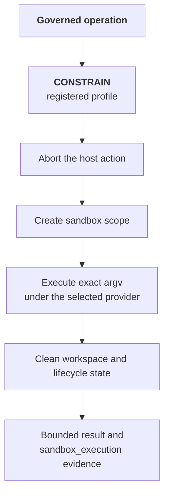

# Sandbox Execution

A `CONSTRAIN` verdict can replace a governed host action with an admitted command in a sandbox.

## Alpha Status

:::info Alpha
Sandbox Execution is in Alpha. Configure it through the SDK and deployment environment. The dashboard does not provide a sandbox toggle.
:::

The default `native` provider uses operating system isolation. It uses Seatbelt through `sandbox-exec` on macOS. It uses bubblewrap on Linux.

The integration must fail closed when it cannot enforce the constraint. `CONSTRAIN` is not a logging form of `ALLOW`. A failed sandbox dispatch never falls back to host execution.

## Execution Sequence

1. A policy or behavioral rule returns `CONSTRAIN` for an operation with a registered command profile.
2. The integration derives an immutable argument vector from the profile. Workflow input cannot supply an arbitrary executable or shell command string.
3. The integration aborts the host action before its side effect.
4. The dispatcher makes at most one sandbox dispatch. It does not switch providers after a possible dispatch.
5. The provider verifies the provisioned policy and profile digest.
6. The provider executes the exact argument vector with bounded output and execution time.
7. The provider performs cleanup after success, failure, timeout, or cancellation.
8. The integration returns a bounded result and emits a `sandbox_execution` span.

A completed hook records the sandbox result. It must not dispatch the command again.

## Native Security Boundary

The native provider applies these controls:

- It compiles policy templates during provisioning.
- It stores compiled profiles in owner-only files.
- It pins the profile SHA-256 digest in service configuration.
- It verifies the digest before execution.
- It clears the command environment.
- It does not accept caller-selected mounts, credentials, working directories, or environment variables.
- It permits writes only in the sandbox workspace.
- It invokes the argument vector directly without a shell.
- It uses a private network namespace for Linux deny-network policies.
- It uses an execution-scoped HTTP and HTTPS proxy for per-domain allowlists.

For a network-enabled policy, the proxy resolves DNS outside the sandbox. It compares each normalized `host:port` with the provisioned endpoints. It returns HTTP 403 for denied hosts and IP-literal bypass attempts.

On macOS, Seatbelt permits only the ephemeral loopback proxy port for that execution. Direct sockets cannot provide another egress path. A stopped proxy also cannot provide another egress path.

## Violation Monitoring

Terminal evidence records each observed proxy decision. Each record contains the decision, host, and port.

On macOS, the service queries the unified log for Seatbelt violations from the exact sandbox process. It records the violation count and stable denial categories.

Linux bubblewrap does not provide an equivalent unprivileged denial stream for each process. Linux results omit operating system violation records. Proxy decisions remain available for proxy-aware HTTP and HTTPS clients.

## Client-Owned Runtime

The sandbox service and its mTLS credentials run in infrastructure that you control. OpenBox governs the operation and records the result. OpenBox does not host or execute the command.

The local service owns scope creation, execution, cleanup, and restart reconciliation for each request.

Provider selection is explicit. A provider startup or execution failure does not cause fallback.

## Configuration

Configure the runtime through the agent SDK and deployment environment. Temporal Python supports governed commands through these components:

- `OpenBoxPlugin(..., sandbox=SandboxConfig(...))`
- An immutable `GovernedCommandRegistry`
- A provisioned provider and policy
- The generated mTLS configuration

See [Governed Sandbox Commands](/developer-guide/temporal-python/concept) for the integration model.

## Evidence

Open the agent and select the **Verify** tab. Pick the session, then switch the view to **Tree**. Inspect the `sandbox_execution` span for these values:

- Provider, command profile, and stable dispatch identity.
- `openbox.sandbox.disposition`.
- `openbox.sandbox.exit_code`.
- Timeout and cleanup status.
- Bounded standard output and standard error byte counts and hashes.
- Egress decisions under `openbox.sandbox.egress.*`.
- macOS violation data under `openbox.sandbox.violations.*`, when present.
- Accepted typed results under `openbox.sandbox.result.*`, when configured.

A governance decision proves authorization. It does not prove execution.

The correlated lifecycle span provides bounded operational evidence. It is not a portable signed execution receipt. It is also not a kernel teardown attestation.

Treat a command as indeterminate when cleanup or terminal absence is uncertain. Reconcile external state without another dispatch.

## Related Pages

- [Governance Decisions](/core-concepts/governance-decisions): Canonical `CONSTRAIN` semantics.
- [Authorize Phase](/trust-lifecycle/authorize): Location of `CONSTRAIN` in the authorization pipeline.
- [Governed Sandbox Commands](/developer-guide/temporal-python/concept): Temporal interception, profiles, and results.
- [Native Provider](/developer-guide/temporal-python/native-provider): Native installation, verification, and limitations.
