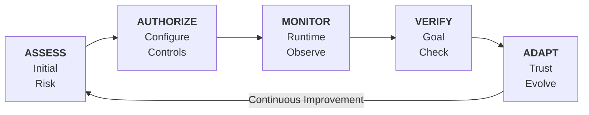

# Trust Lifecycle

The Trust Lifecycle is OpenBox's governance model. It provides a structured approach to establishing, maintaining, and evolving trust in AI agents through 5 phases.

Access each phase via the tabs in **Agent Detail**.



## Phase Overview

| Phase | Tab | Purpose | Key Activities |
|-------|-----|---------|----------------|
| **[Assess](/docs/trust-lifecycle/assess)** | Assess | Establish baseline risk | Risk profile configuration, risk profiling |
| **[Authorize](/docs/trust-lifecycle/authorize)** | Authorize | Define allowed behaviors | Guardrails, policies, behavioral rules |
| **[Monitor](/docs/trust-lifecycle/monitor)** | Monitor | Observe runtime execution | Sessions, metrics, telemetry |
| **[Verify](/docs/trust-lifecycle/verify)** | Verify | Validate goal alignment | Drift detection, attestation |
| **[Adapt](/docs/trust-lifecycle/adapt)** | Adapt | Evolve trust over time | Policy suggestions, trust recovery |

## Trust Score

The Trust Score (0-100) aggregates across the lifecycle:

```
Trust Score = (Risk Profile Score × 40%) + (Behavioral × 35%) + (Alignment × 25%)
```

| Component | Phase | Description |
|-----------|-------|-------------|
| **Risk Profile** | Assess | Inherent risk based on capabilities and access |
| **Behavioral** | Authorize + Monitor | Compliance with policies and rules |
| **Alignment** | Verify | Consistency with stated goals |

## Trust Tiers

The Trust Score maps to Trust Tiers that determine governance strictness:

| Tier | Risk Profile Score | Risk Level | Governance Level |
|------|-------------|------------|------------------|
| **Tier 1** | 0% – 24% | Low | Minimal constraints, high autonomy |
| **Tier 2** | 25% – 49% | Medium | Standard policies, normal monitoring |
| **Tier 3** | 50% – 74% | High | Enhanced controls, frequent checks |
| **Tier 4** | 75% – 100% | Critical | Strict governance, HITL required |

## Lifecycle Flow

### New Agents

1. **Assess** - Configure risk profile
2. **Authorize** - Set up initial guardrails and policies
3. Agent begins operation
4. **Monitor** - Observe sessions and metrics
5. **Verify** - Check goal alignment
6. **Adapt** - Review suggestions, adjust policies

### Ongoing Governance

The lifecycle is continuous. As agents operate:

- Behavioral scores update based on compliance
- Alignment scores update based on goal checks
- Trust Tiers adjust automatically
- Policy suggestions emerge from patterns

## Navigating the Lifecycle

In Agent Detail, click the phase tabs:

- **Assess** - View/edit risk configuration
- **Authorize** - Manage guardrails, policies, behavioral rules
- **Monitor** - View sessions, metrics, telemetry
- **Verify** - Check alignment, view attestations
- **Adapt** - Review suggestions, handle approvals

## Next Steps

Follow the Trust Lifecycle phases in order:

1. **[Assess](/docs/trust-lifecycle/assess)** - Start here to understand your agent's risk profile
2. **[Authorize](/docs/trust-lifecycle/authorize)** - Then configure what your agent is allowed to perform
3. **[Monitor](/docs/trust-lifecycle/monitor)** - Watch your agent operate in real-time
4. **[Verify](/docs/trust-lifecycle/verify)** - Validate goal alignment
5. **[Adapt](/docs/trust-lifecycle/adapt)** - Evolve trust based on behavior
