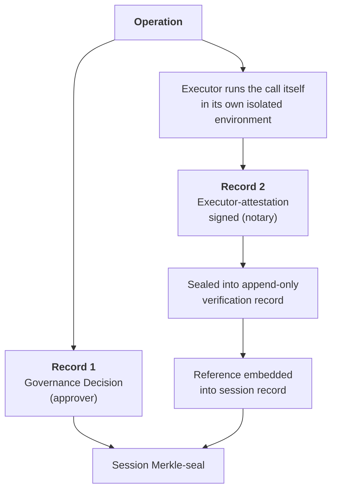

# Proof Engine

:::tip 🆕 New page in this review
Everything on this page is new.
:::

The Proof Engine produces a second, linked record for designated operations, on top of the single-record attestation every session already gets from [Attestation & Cryptographic Proof](/administration/attestation-and-cryptographic-proof).

## Two Records, Not One

| Record | Produced by | Role |
|--------|-------------|------|
| **Record 1: Governance Decision** | The Authorize pipeline | The approver: what verdict was issued, and why |
| **Record 2: Executor-Attestation** | The Executor, signed | The notary: the Executor runs the call itself, inside its own isolated environment, then signs the exact request it sent and the exact response it received |

For designated high-stakes calls, the permitted operation isn't handed back to the agent to carry out. It's handed off to the OpenBox Executor, which executes the call itself inside its own isolated environment; the agent never touches the call directly. The Executor then signs the exact request and response it produced. That signed artifact is the executor-attestation.

The executor-attestation is sealed into an append-only verification record, and a reference to that record is embedded into the session record *before* the session's Merkle root is sealed. That reference is what links Record 1 and Record 2: faking either one breaks the other, so an auditor can verify not just that a decision was made, but that the operation it authorized actually happened as described.

## How This Differs From Standard Attestation

[Attestation & Cryptographic Proof](/administration/attestation-and-cryptographic-proof) signs the session's event history (including governance decisions) into one Merkle-sealed proof certificate per session. That baseline is unchanged and still applies to every session.

The Proof Engine adds a second, independently signed record for designated operations: proof of the actual wire-level request and response, not just the decision that authorized it. Record 1 answers "was this allowed?" Record 2 answers "did this really happen, exactly as recorded?"

:::note Open question
Which calls get this second, notarized record (a policy outcome, a behavioral-rule verdict, or a per-agent setting) hasn't been finalized. This page will be updated once the designation control is settled.
:::

## Related

- **[Attestation & Cryptographic Proof](/administration/attestation-and-cryptographic-proof)**: The single-record baseline every session gets
- **[Cognitive Debugger](/trust-lifecycle/cognitive-debugger)**: Uses both records to reconstruct why an agent misbehaved
- **[Compliance & Audit](/administration/compliance-and-audit)**: Cites Proof Engine evidence in evidence packs
